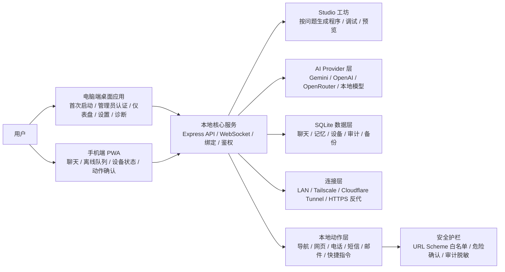
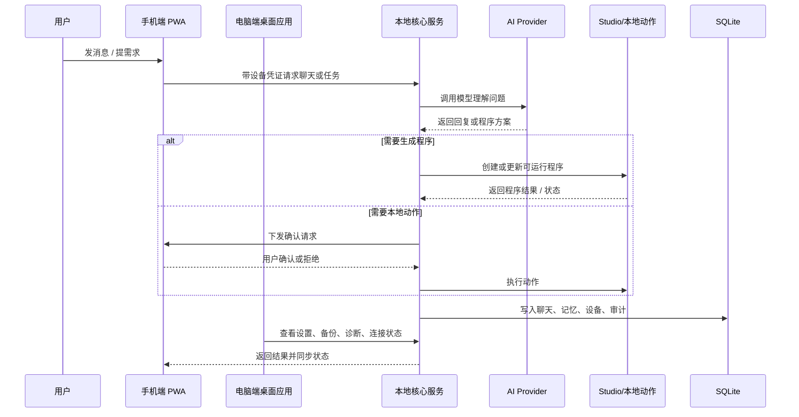
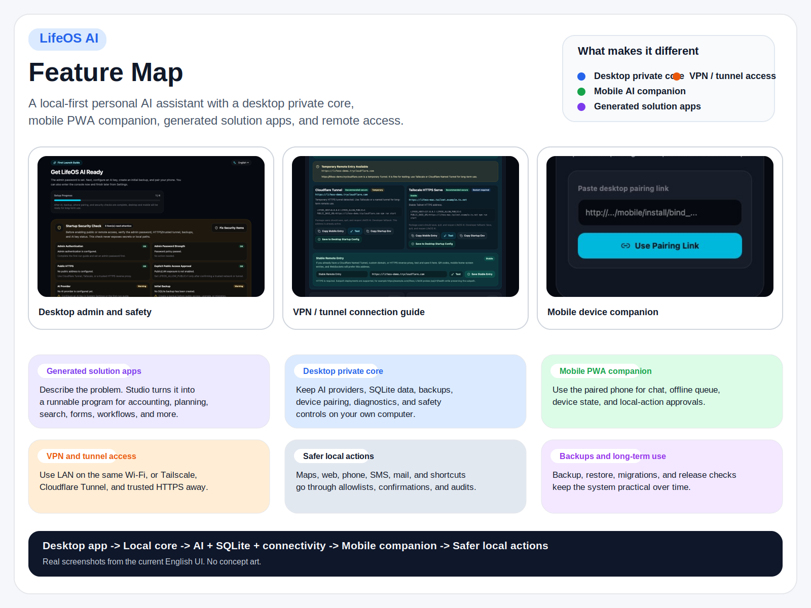
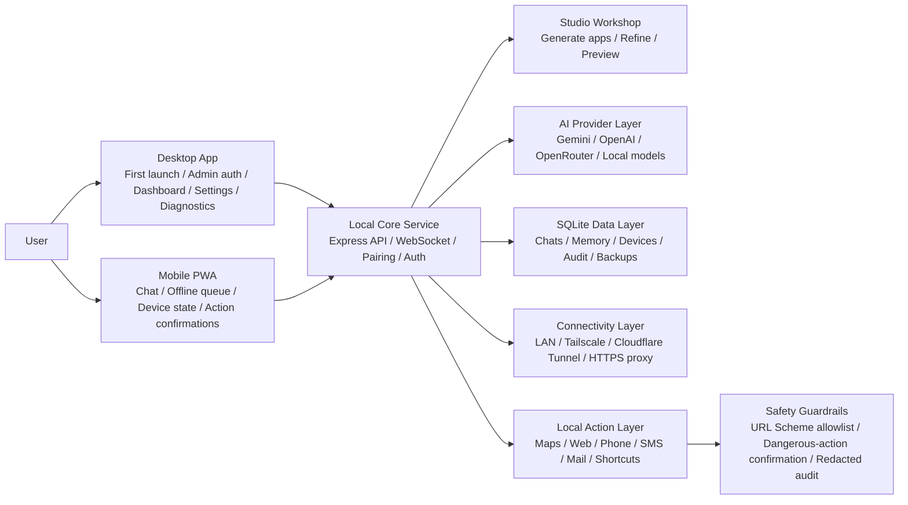
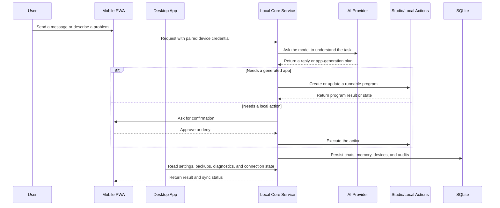

# LifeOS AI

中文 | [English](#english)

[](https://github.com/WGJ-Fry/lifeos-ai/actions/workflows/quality.yml)
[](https://github.com/WGJ-Fry/lifeos-ai/releases)
[](#许可)

**把你的电脑变成私人 AI 核心，把手机变成随身 AI 管家，还能为当前问题自动生成解决程序。**

LifeOS AI 是一个本地优先的个人 AI 管家/助手：当你遇到具体问题时，Studio 可以自动生成应对问题的离线程序来帮助你解决；电脑端负责运行本地核心、连接 AI 服务、保存 SQLite 数据、管理设备和安全设置；手机端通过浏览器/PWA 使用已经绑定的个性化 AI。

当前仓库已经具备可分发桌面包、移动端 PWA、管理员认证、设备绑定、SQLite 数据、备份恢复、连接向导、URL Scheme 安全控制、AI 多 provider 配置和发布校验。

面向普通用户的首次路径已经收口成一条 5 分钟链路：安装桌面端，设置管理员密码，配置 AI Key，创建初始备份，手机扫码绑定，完成首次向导后直接进入第一次聊天；如果桌面窗口异常或本地核心启动失败，可以直接使用 `Retry LifeOS AI`、`Open Local Console In Browser`、`Copy Local Address`、`Open Logs Folder`、`Copy Logs Path`、`Export Desktop Diagnostics` 继续恢复。


<p>
  <a href="https://github.com/WGJ-Fry/lifeos-ai/releases/tag/v0.1.0"><strong>下载最新版本</strong></a>
  ·
  <a href="docs/quick-start.md">5 分钟开始</a>
  ·
  <a href="docs/user-install-guide.md">安装指南</a>
  ·
  <a href="docs/promotion-kit.md">推广素材</a>
  ·
  <a href="docs/faq.md">常见问题</a>
  ·
  <a href="SECURITY.md">安全说明</a>
</p>

## 30 秒看懂

LifeOS AI 是一个所有人都可以长期自用的个人 AI 管家，它把问题理解、自动生成程序、电脑、手机、AI、网络和本地能力连成一个系统：

1. **自动生成解决问题的程序**：当你有记账、规划、查询、整理、打卡、计算、表单、流程面板等具体需求时，AI 会根据当前问题生成可运行的程序来帮你处理，并支持继续调试。
2. **电脑端私有 AI 核心**：连接 Gemini、OpenAI、OpenRouter 或本地模型，统一保存 SQLite 数据、备份、设备和安全设置。
3. **手机端随身 AI 管家**：扫码绑定后作为 PWA 使用，聊天、离线队列、设备状态和动作确认都在手机上完成。
4. **VPN/隧道异地连接**：同 Wi-Fi 用 LAN，不在同一局域网时用 Tailscale、Cloudflare Tunnel 或可信 HTTPS 反向代理。
5. **安全调用本地 App**：导航、网页、电话、短信、邮件、快捷指令等动作经过 URL Scheme 白名单、危险确认和审计日志。

5 分钟开始使用：下载电脑端，设置管理员密码，配置 AI Key，手机扫码绑定，然后开始聊天、生成小工具或配置异地连接。详见 [快速开始](docs/quick-start.md)。

## 亮点

- **自动生成解决程序**：根据用户当前要解决的问题，自动生成可运行的离线程序/微应用来辅助处理，并支持继续调试 HTML/CSS/JS。
- **个人 AI 管家**：电脑端做私有核心，手机端做随身入口。
- **本地优先**：聊天、记忆、设备、审计和备份统一进入本机 SQLite。
- **跨网络使用**：同 Wi-Fi 用 LAN，异地优先走 Tailscale、Cloudflare Tunnel 或可信 HTTPS 反向代理。
- **VPN/隧道向导**：自动检测局域网地址，提供 Tailscale、Cloudflare Tunnel 启动命令和桌面启动配置。
- **AI 多 provider**：支持 Gemini、OpenAI、OpenRouter、本地模型接口配置。
- **移动 PWA**：扫码绑定手机，支持离线队列、设备状态和动作权限中心。
- **安全本地动作**：导航、网页、电话、短信、邮件、快捷指令等 URL Scheme 白名单，危险动作二次确认，审计日志脱敏。
- **可安装桌面包**：macOS DMG、Windows NSIS、Linux AppImage。

## 它能帮你做什么

LifeOS AI 的目标不是再做一个普通聊天窗口，而是把个人 AI 放进一个长期可用的系统里：电脑保存你的数据、密钥和本地能力，手机负责随时调用。

| 场景 | 能力 |
| --- | --- |
| 随身个人 AI 管家 | 手机扫码绑定后作为 PWA 使用，聊天、查看设备状态、处理离线消息。 |
| 电脑私有 AI 核心 | 管理 AI provider、API Key、SQLite 数据、备份恢复、审计和安全策略。 |
| 不同网络连接 | 同 Wi-Fi 使用 LAN，异地优先使用 Tailscale、Cloudflare Tunnel 或可信 HTTPS 反向代理。 |
| 自动生成解决程序 | 根据当前问题自动生成可运行的离线程序/微应用，用来处理记账、规划、整理、打卡、计算、表单和流程面板等需求。 |
| 调用本地能力 | 打开导航、网页、电话、短信、邮件、快捷指令等动作前先经过白名单和危险确认。 |
| 长期自用 | 备份、恢复、诊断包、迁移文件和发布校验让数据与安装包可追踪。 |

## 界面预览

下面截图来自当前真实运行的本地页面，不是概念图。

| 首次启动与安全自检 | VPN/隧道连接向导 | 手机端绑定入口 |
| --- | --- | --- |
|  |  |  |

## 下载安装

最新版本下载入口：

[下载 LifeOS AI 0.1.0 / Download LifeOS AI 0.1.0](https://github.com/WGJ-Fry/lifeos-ai/releases/tag/v0.1.0)

直接下载：

- [macOS Apple Silicon unsigned ZIP](https://github.com/WGJ-Fry/lifeos-ai/releases/download/v0.1.0/LifeOS.AI-0.1.0-arm64-unsigned.zip)
- [SHA256SUMS](https://github.com/WGJ-Fry/lifeos-ai/releases/download/v0.1.0/SHA256SUMS)

安装说明：

- macOS：下载 unsigned ZIP，解压后把 `LifeOS AI.app` 拖入 Applications；如遇 Gatekeeper 提示，请查看 Release 附件里的 `INSTALL-unsigned-mac.md`。
- Windows：安装器仍在准备上传；当前公开 Release 暂未提供 Windows 安装包。
- Linux：AppImage 仍在准备上传；当前公开 Release 暂未提供 Linux 安装包。

完整说明见 [用户安装使用指南](docs/user-install-guide.md)。

## 当前发布状态

当前公开 Release 已上传真实可下载产物：

| 平台 | 文件 | 状态 |
| --- | --- | --- |
| macOS Apple Silicon | `release/LifeOS AI-0.1.0-arm64-unsigned.zip` | unsigned ZIP，已上传到 GitHub Release |
| Windows x64 | 准备中 | NSIS 安装器待重新打包并上传 |
| Linux x64 | 准备中 | AppImage 待重新打包并上传 |

当前仓库已验证的发布校验：

```text
npm run release:check
172 passed, 0 warnings, 0 failures
```

当前 `unsigned` 发布检查已经全绿；如果要做到“下载后基本无系统拦截”的 macOS 公网分发体验，还需要带上 `CSC_LINK`、`CSC_KEY_PASSWORD`、`APPLE_ID`、`APPLE_APP_SPECIFIC_PASSWORD`、`APPLE_TEAM_ID` 生成签名公证版。之后若要启用自动更新，再额外配置 `LIFEOS_UPDATE_URL` 即可。

## 功能概览

- 电脑管理端：首次启动向导、管理员登录、仪表盘、设备绑定、AI 设置、聊天、记忆、备份恢复、诊断导出。
- 手机端 PWA：扫码绑定、移动聊天、离线队列、设备与连接状态、动作权限中心。
- 本地后端：Express API、WebSocket 实时连接、SQLite 持久化、迁移文件体系。
- AI 配置：支持 Gemini、OpenAI、OpenRouter、本地模型预留；API Key 保存在电脑端安全存储或本地加密存储。
- Studio 工坊：根据用户当前要解决的问题自动生成离线程序/微应用；支持沙箱预览、源码复制、响应式预览、继续细化和本地持久化。
- 异地连接：内置 LAN、Tailscale、Cloudflare Tunnel、HTTPS 反向代理连接向导，生成启动环境和手机入口。
- 安全底座：HttpOnly Cookie、CSRF、登录锁定、绑定限速、设备签名/Token 迁移、危险动作确认、URL Scheme 白名单、审计日志脱敏。
- 桌面体验：Electron 启动本地核心、失败页、菜单/托盘状态、日志目录、诊断包。
- 发布链路：macOS 签名公证、Windows NSIS、Linux AppImage、update feed、SHA256SUMS、release manifest。

## 功能地图



### 能力分层

| 层级 | 负责什么 | 典型能力 |
| --- | --- | --- |
| 用户入口层 | 让用户随时随地进入系统 | 电脑端管理、手机端聊天、扫码绑定、PWA 安装到主屏幕 |
| AI 工作层 | 把对话变成真正可执行的帮助 | 普通聊天、记忆调用、自动生成解决问题的程序、继续调试 |
| 系统能力层 | 让 AI 能接触真实世界但不失控 | 联网访问、调用本地动作、生成导航/电话/网页/快捷指令 |
| 数据持久层 | 把长期使用需要的数据统一收住 | SQLite 聊天、记忆、设备、审计、备份、迁移 |
| 安全运维层 | 保证能长期自用且不会轻易出事 | 管理员认证、CSRF、限速、白名单、危险确认、诊断包 |

| 模块 | 用户能做什么 | 背后依赖 |
| --- | --- | --- |
| 电脑端桌面应用 | 完成首次启动、配置管理员密码、配置 AI、查看安全状态、导出诊断 | Electron、本地核心、管理端 UI |
| 手机端 PWA | 随时聊天、补写离线消息、查看连接状态、确认本地动作 | 浏览器/PWA、绑定凭证、后台同步、WebSocket |
| Studio 工坊 | 把当前问题变成可运行程序，用来记账、规划、查询、整理、打卡、计算、表单、流程面板等 | AI provider、沙箱运行时、源码编辑、持久化 |
| AI Provider 层 | 在 Gemini、OpenAI、OpenRouter、本地模型之间切换 | 电脑端密钥存储、模型配置、请求路由 |
| SQLite 数据层 | 长期保存聊天、记忆、设备、审计、备份元数据 | 本地数据库、迁移文件、备份恢复 |
| 连接层 | 局域网访问、异地访问、生成手机入口、验收远程入口 | LAN、Tailscale、Cloudflare Tunnel、可信 HTTPS |
| 本地动作层 | 安全打开导航、网页、电话、短信、邮件、快捷指令 | URL Scheme、白名单、风险分级、确认弹窗 |
| 安全与运维 | 登录保护、CSRF、防误公网暴露、备份恢复、诊断包、发布校验 | HttpOnly Cookie、限速、审计脱敏、测试门禁 |

## 系统数据流



## 使用路径

1. 电脑端先完成管理员认证、AI 配置和初始备份。
2. 手机端通过二维码或绑定链接接入，成为日常入口。
3. 日常使用既可以直接聊天，也可以把具体问题交给 Studio 生成程序处理。
4. 数据统一回到电脑端 SQLite，本地动作统一经过白名单和确认。
5. 同局域网用 LAN；不在同一局域网时用 Tailscale、Cloudflare Tunnel 或可信 HTTPS 入口。

## 普通用户安装

### macOS

下载 `LifeOS AI-0.1.0-arm64.dmg`，打开后把 `LifeOS AI` 拖入 Applications。当前 DMG 已签名并公证。

### Windows

下载 `LifeOS AI Setup 0.1.0.exe` 并运行。当前 Windows 包未配置 Authenticode 证书，Windows SmartScreen 可能提示未知发布者；请只从可信 GitHub Release 下载，并对照 `SHA256SUMS` 校验。

### Linux

下载 `LifeOS AI-0.1.0.AppImage`：

```bash
chmod +x "LifeOS AI-0.1.0.AppImage"
./"LifeOS AI-0.1.0.AppImage"
```

更多普通用户说明见 [docs/user-install-guide.md](docs/user-install-guide.md)。

## 首次使用

1. 打开电脑端 LifeOS AI。
2. 设置管理员密码。
3. 在管理端配置 AI provider 和 API Key。
4. 打开手机绑定页，用手机扫码。
5. 手机完成绑定后，再从已绑定页面添加到主屏幕。
6. 创建初始备份，并建议开启自动备份。
7. 完成首次向导后，直接进入第一次聊天，发一条测试消息确认 AI、本地核心和聊天链路都正常。

手机和电脑在同一局域网时，可以使用管理端推荐的 LAN 地址。异地使用建议通过 Tailscale 或 Cloudflare Tunnel，不建议直接把本地服务暴露到公网。

如果桌面窗口没有正常打开，但本地核心已经启动，可以直接使用桌面失败页里的 `Open Local Console In Browser` 或 `Copy Local Address`，先在浏览器继续完成管理员设置、AI Key 配置、手机绑定和第一次聊天；之后再用 `Open Logs Folder` 或 `Export Desktop Diagnostics` 排查桌面壳问题。

## 数据与隐私

默认数据保存在电脑本机 SQLite 中。桌面安装版会使用系统应用数据目录，开发模式默认使用 `data/lifeos.db`。诊断包、审计日志和导出接口会脱敏 AI Key、Token、密码、私钥、本地路径等敏感内容。

隐私说明见 [PRIVACY.md](PRIVACY.md)，安全说明见 [SECURITY.md](SECURITY.md)。

## 开发

```bash
npm install
npm run dev
```

打开：

```text
http://localhost:3000/admin/login
```

也可以启动桌面壳：

```bash
npm run desktop
```

环境变量示例见 [.env.example](.env.example)。推荐在管理端 UI 中配置 AI Key；只有开发或服务器部署时才需要 `.env.local`。

## 打包

macOS 正式签名打包前先检查签名环境：

```bash
source .env.signing.local
npm run signing:check:mac
npm run desktop:dist:mac
```

Windows/Linux 从 macOS 交叉打包时，脚本会下载对应平台 Electron：

```bash
ELECTRON_MIRROR=https://npmmirror.com/mirrors/electron/ npm run desktop:dist:win
ELECTRON_MIRROR=https://npmmirror.com/mirrors/electron/ npm run desktop:dist:linux
```

生成 update feed 和校验：

```bash
npm run release:feed
LIFEOS_DISTRIBUTION=signed npm run release:check
```

发布到 GitHub 前请阅读 [docs/github-release.md](docs/github-release.md) 和 [docs/release-assets.md](docs/release-assets.md)。

## 发布资产

当前建议上传到 GitHub Release 的文件：

```text
release/LifeOS AI-0.1.0-arm64.dmg
release/LifeOS AI Setup 0.1.0.exe
release/LifeOS AI-0.1.0.AppImage
release/SHA256SUMS
release/update-feed/latest-mac.yml
release/update-feed/latest.yml
release/update-feed/latest-linux.yml
release/update-feed/release-manifest.json
```

如果暂不启用自动更新，仍建议上传 `latest*.yml` 和 `release-manifest.json`，方便以后平滑开启。

## 文档

- [普通用户安装指南](docs/user-install-guide.md)
- [5 分钟快速开始](docs/quick-start.md)
- [常见问题 FAQ](docs/faq.md)
- [GitHub 发布指南](docs/github-release.md)
- [发布资产清单](docs/release-assets.md)
- [桌面发布说明](docs/desktop-release.md)
- [发布前检查清单](docs/release-checklist.md)
- [回滚指南](docs/rollback.md)
- [反馈与贡献说明](CONTRIBUTING.md)
- [隐私说明](PRIVACY.md)
- [安全说明](SECURITY.md)

## 许可

当前仓库没有开放源代码许可证。除非另行添加 LICENSE，本项目默认保留所有权利。公开到 GitHub 时，其他人可以查看代码，但没有被授予复制、修改、再分发或商用授权。

---

# English

[](https://github.com/WGJ-Fry/lifeos-ai/actions/workflows/quality.yml)
[](https://github.com/WGJ-Fry/lifeos-ai/releases)
[](#license)

**Turn your desktop into a private AI core, your phone into an always-available personal AI assistant, and your current problems into generated solution apps.**

LifeOS AI is a local-first personal AI assistant with a Studio workshop that generates runnable offline programs for the problem you are trying to solve. The desktop app runs the local backend, connects to AI providers, stores SQLite data, manages devices and security settings, and serves the mobile experience. The phone uses a browser/PWA after pairing.


## Understand It In 30 Seconds

LifeOS AI is a personal AI assistant designed for long-term everyday use. It connects problem understanding, generated solution apps, your desktop, phone, AI providers, network access, and local capabilities into one system:



1. **AI-generated solution apps**: when you need help with accounting, planning, searching, organizing, habit tracking, calculators, forms, or workflow panels, AI generates a runnable offline program for that problem and lets you keep refining HTML/CSS/JS.
2. **Desktop private AI core**: connect Gemini, OpenAI, OpenRouter, or local models while keeping SQLite data, backups, devices, and security settings on your computer.
3. **Mobile personal AI companion**: pair your phone as a PWA for chat, offline queue, device state, and local-action confirmations.
4. **VPN/tunnel remote access**: use LAN on the same Wi-Fi, or Tailscale, Cloudflare Tunnel, or a trusted HTTPS reverse proxy away from home.
5. **Safer local app actions**: maps, web, phone, SMS, mail, shortcuts, and other actions go through URL Scheme allowlists, confirmations, and audit logs.

Start in five minutes: download the desktop app, set an admin password, configure an AI key, pair your phone, then chat, generate tools, or configure remote access. See [Quick Start](docs/quick-start.md).

## Highlights

- **AI-generated solution apps**: generate runnable offline programs from the problem the user needs to solve, then refine HTML/CSS/JS in the sandbox.
- **Personal AI assistant**: the desktop runs the private core; the phone becomes the daily companion.
- **Local-first data**: chats, memories, devices, audits, and backups live in local SQLite.
- **Away-from-home access**: use LAN on the same Wi-Fi, or Tailscale, Cloudflare Tunnel, or a trusted HTTPS reverse proxy remotely.
- **VPN/tunnel guide**: detects LAN addresses and provides Tailscale / Cloudflare Tunnel commands and desktop startup configuration.
- **Multi-provider AI**: configure Gemini, OpenAI, OpenRouter, and local model endpoints.
- **Mobile PWA**: pair by QR code, then use chat, offline queue, device status, and action permissions.
- **Safer local actions**: navigation, web, phone, SMS, mail, shortcuts, and other URL Schemes are allowlisted, confirmed, and audited.
- **Installable desktop builds**: macOS DMG, Windows NSIS, and Linux AppImage.

## What It Helps You Do

LifeOS AI is not just another chat box. It is a long-lived personal AI system: your desktop keeps the data, keys, network access, and local capabilities; your phone becomes the everyday companion.

| Scenario | Capability |
| --- | --- |
| Personal AI on your phone | Pair the mobile PWA, chat, view device state, and keep offline messages queued. |
| Private desktop AI core | Manage AI providers, API keys, SQLite data, backup/restore, audits, and safety settings. |
| Remote access | Use LAN on the same Wi-Fi, or Tailscale, Cloudflare Tunnel, or a trusted HTTPS reverse proxy away from home. |
| Generate solution apps | Turn the current problem into a runnable offline program for accounting, planning, organizing, habit tracking, calculators, forms, and workflow panels. |
| Safer local actions | Open maps, web pages, phone, SMS, mail, and shortcuts only through allowlists and confirmations. |
| Long-term use | Backups, restore tasks, diagnostics, migrations, and release checks make the system maintainable. |

## Feature Map



### Capability Layers

| Layer | What it owns | Example capabilities |
| --- | --- | --- |
| User entry layer | How the user gets into the system every day | Desktop admin, mobile chat, QR pairing, install-to-home-screen PWA |
| AI work layer | How conversation becomes real help | Chat, memory recall, generate a solution app, keep refining it |
| System capability layer | How AI can reach the outside world safely | Network access, local actions, maps, phone, web, shortcuts |
| Persistence layer | How long-term data stays organized | SQLite chats, memory, devices, audit events, backups, migrations |
| Safety and operations layer | How the system stays usable over time | Admin auth, CSRF, rate limits, allowlists, confirmations, diagnostics |

| Module | What the user gets | What it depends on |
| --- | --- | --- |
| Desktop app | First-run setup, admin password, AI configuration, security overview, diagnostics export | Electron shell, local core, desktop admin UI |
| Mobile PWA | Everyday chat, offline message retry, connection status, local-action approvals | Browser/PWA, paired device credential, background sync, WebSocket |
| Studio workshop | Turn a current problem into a runnable app for accounting, planning, search, organizing, habit tracking, calculators, forms, and workflow panels | AI providers, sandbox runtime, code editor, persistence |
| AI provider layer | Switch between Gemini, OpenAI, OpenRouter, or local models | Desktop key storage, model settings, request routing |
| SQLite data layer | Keep chats, memories, devices, audit events, and backup metadata on the computer | Local database, migrations, backup/restore |
| Connectivity layer | Same-Wi-Fi access, remote access, mobile entry generation, remote smoke validation | LAN, Tailscale, Cloudflare Tunnel, trusted HTTPS |
| Local action layer | Safer launch of maps, web pages, phone, SMS, mail, and shortcuts | URL Schemes, allowlist, risk grading, confirmation UI |
| Security and operations | Login protection, CSRF, remote-access safety, backups, diagnostics, release validation | HttpOnly cookies, rate limits, redaction, test gates |

## System Data Flow



## Usage Flow

1. The desktop app handles admin auth, AI setup, and the first backup.
2. The phone pairs by QR code or pairing link and becomes the everyday entry point.
3. Daily use can stay in chat, or move into Studio when the user needs a generated solution app.
4. Data flows back to desktop SQLite, while local actions always go through allowlists and confirmations.
5. LAN works on the same Wi-Fi; remote use goes through Tailscale, Cloudflare Tunnel, or a trusted HTTPS entry.

## Interface Preview

These are real English UI screenshots from the current running app, not concept art.

| First launch and safety check | VPN / tunnel connection guide | Mobile pairing entry |
| --- | --- | --- |
|  |  |  |

## Download And Install

Latest release:

[Download LifeOS AI 0.1.0](https://github.com/WGJ-Fry/lifeos-ai/releases/tag/v0.1.0)

Direct downloads:

- [macOS Apple Silicon unsigned ZIP](https://github.com/WGJ-Fry/lifeos-ai/releases/download/v0.1.0/LifeOS.AI-0.1.0-arm64-unsigned.zip)
- [SHA256SUMS](https://github.com/WGJ-Fry/lifeos-ai/releases/download/v0.1.0/SHA256SUMS)

Install notes:

- macOS: download the unsigned ZIP, unzip it, and drag `LifeOS AI.app` into Applications. If Gatekeeper warns, see `INSTALL-unsigned-mac.md` in the release assets.
- Windows: the installer is still being prepared for upload; the current public Release does not provide a Windows installer yet.
- Linux: the AppImage is still being prepared for upload; the current public Release does not provide a Linux package yet.

See [User Install Guide](docs/user-install-guide.md) for details.

## Release Status

The current public Release only links to artifacts that really exist:

| Platform | File | Status |
| --- | --- | --- |
| macOS Apple Silicon | `release/LifeOS AI-0.1.0-arm64-unsigned.zip` | Unsigned ZIP uploaded to GitHub Release |
| Windows x64 | Preparing | NSIS installer needs a fresh packaged upload |
| Linux x64 | Preparing | AppImage needs a fresh packaged upload |

Release gate:

```text
npm run release:check
172 passed, 0 warnings, 0 failures
```

The repo currently proves the strict `unsigned` release path end to end. For a smoother public macOS install with fewer system prompts, build the DMG with the signing variables (`CSC_LINK`, `CSC_KEY_PASSWORD`, `APPLE_ID`, `APPLE_APP_SPECIFIC_PASSWORD`, `APPLE_TEAM_ID`). `LIFEOS_UPDATE_URL` remains optional unless you want automatic updates.

## Highlights

- Desktop admin: onboarding, admin auth, dashboard, device pairing, AI settings, chat, memory, backup/restore, diagnostics.
- Mobile PWA: QR pairing, mobile chat, offline queue, device/connection status, action permission center.
- Local backend: Express API, WebSocket realtime, SQLite persistence, migration files.
- AI configuration: Gemini, OpenAI, OpenRouter, and local-model-ready provider model.
- Studio workshop: generate sandboxed offline solution apps from the user's current problem, with source editing and responsive preview.
- Remote connectivity: LAN, Tailscale, Cloudflare Tunnel, and trusted HTTPS reverse-proxy guide with generated launch commands and mobile URLs.
- Security baseline: HttpOnly cookies, CSRF, login lockout, pairing rate limits, device signature/token migration, dangerous action confirmation, URL Scheme allowlist, redacted audit logs.
- Desktop app: Electron local core startup, startup failure page, tray/menu status, logs folder, diagnostic bundle.
- Release chain: macOS signing/notarization, Windows NSIS, Linux AppImage, update feed, SHA256SUMS, release manifest.

## Install

### macOS

Download `LifeOS AI-0.1.0-arm64.dmg`, open it, and drag `LifeOS AI` into Applications. The current DMG is signed and notarized.

### Windows

Download and run `LifeOS AI Setup 0.1.0.exe`. The current Windows package is not Authenticode signed, so SmartScreen may warn about an unknown publisher. Only install from a trusted GitHub Release and verify `SHA256SUMS`.

### Linux

Download `LifeOS AI-0.1.0.AppImage`:

```bash
chmod +x "LifeOS AI-0.1.0.AppImage"
./"LifeOS AI-0.1.0.AppImage"
```

See [docs/user-install-guide.md](docs/user-install-guide.md) for end-user instructions.

## First Run

1. Open the desktop app.
2. Set the administrator password.
3. Configure an AI provider and API key.
4. Open the phone pairing page and scan the QR code.
5. Add the PWA to the phone home screen only after pairing succeeds.
6. Create an initial backup and enable automatic backups.

For remote phone access, prefer Tailscale or Cloudflare Tunnel. Do not expose the local core directly to the public internet without HTTPS and an explicit security review.

## Development

```bash
npm install
npm run dev
```

Open:

```text
http://localhost:3000/admin/login
```

Desktop shell:

```bash
npm run desktop
```

## Packaging

macOS signing check:

```bash
source .env.signing.local
npm run signing:check:mac
npm run desktop:dist:mac
```

Windows and Linux:

```bash
ELECTRON_MIRROR=https://npmmirror.com/mirrors/electron/ npm run desktop:dist:win
ELECTRON_MIRROR=https://npmmirror.com/mirrors/electron/ npm run desktop:dist:linux
```

Generate feed and verify:

```bash
npm run release:feed
LIFEOS_DISTRIBUTION=signed npm run release:check
```

Read [docs/github-release.md](docs/github-release.md) and [docs/release-assets.md](docs/release-assets.md) before uploading to GitHub Releases.
