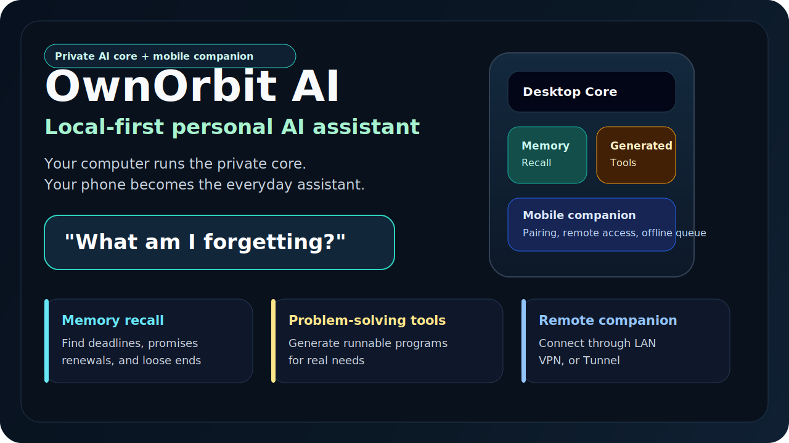
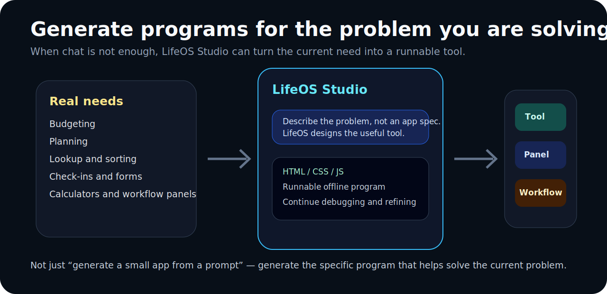
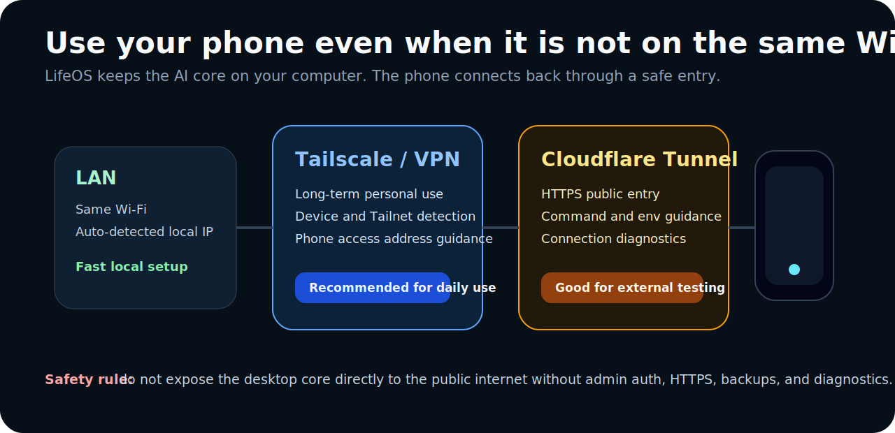

# LifeOS AI

> **A local-first personal AI system for memory, action, and problem-solving tools.**
>
> Your computer runs the private AI core. Your phone becomes the everyday companion.

[中文说明](README.zh-CN.md) | [Release Status](#release-status) | [Quick Start](#2-minute-setup) | [Generated Programs](#generated-problem-solving-programs) | [Remote Access](#remote--vpn-access) | [Current Limits](#current-alpha-limits)

[](https://github.com/WGJ-Fry/lifeos-ai/actions/workflows/quality.yml)
[](https://github.com/WGJ-Fry/lifeos-ai/actions/workflows/docker.yml)
[](https://github.com/WGJ-Fry/lifeos-ai/releases)
[](LICENSE)

<p align="center">
  
</p>

LifeOS starts with one small but useful workflow:

```text
What am I forgetting?
```

It reads local Markdown notes, runs with local Ollama in the alpha demo, and surfaces commitments, deadlines, renewals, and unfinished work that might otherwise slip through the cracks.

## 10-Second Summary

- **Local Markdown memory:** reads `.md` files from a folder you control.
- **Fastest demo path:** Docker Compose + Ollama `llama3.2`.
- **Desktop admin:** setup, AI provider settings, backup/restore, diagnostics, and device pairing.
- **Mobile PWA:** paired phone chat, offline queue, device status, and action permission center.
- **Connection guide:** LAN, Tailscale, and Cloudflare Tunnel diagnostics with safety checks.
- **Studio tools:** generate and refine runnable problem-solving programs with state storage, runtime logs, and rollback.

Current release promise: put Markdown notes in a folder, run LifeOS locally, and ask what you may have missed.

## Release Status

Public release tag: [`v0.1.2-alpha`](https://github.com/WGJ-Fry/lifeos-ai/releases/tag/v0.1.2-alpha)<br>
Source package version: `0.1.2-alpha.0`

The table below separates packaged downloads from source-branch capabilities so new users do not confuse a release artifact with later `main` commits.

| Track | Completed capabilities |
| --- | --- |
| `v0.1.2-alpha` public release | Docker Compose local Markdown demo, GHCR image path, macOS unsigned ZIP, Windows NSIS installer, Linux AppImage, admin auth, AI provider settings, mobile PWA pairing, offline queue, SQLite migrations, backup/restore, diagnostics, release checks, and connection diagnostics. |
| Current `main` source | Everything above, plus the latest Studio generated-program runtime log repair flow in source. Build from source if you want the newest code before the next packaged release. |
| Earlier base | `0.1.1-alpha.0` added Docker quickstart/Ollama/Markdown vault defaults. `0.1.0` started the desktop/PWA foundation. |

## Choose Your Path

| Path | Use this when | Current public status |
| --- | --- | --- |
| **Docker Compose alpha** | You want the fastest local demo with Ollama and Markdown notes. | Recommended first try. Uses `ghcr.io/wgj-fry/lifeos-ai:v0.1.2-alpha`. |
| **macOS desktop ZIP** | You want to try the early desktop shell on Apple Silicon. | Available in the [`v0.1.2-alpha` Release](https://github.com/WGJ-Fry/lifeos-ai/releases/tag/v0.1.2-alpha): `LifeOS AI-0.1.2-alpha.0-arm64-unsigned.zip`. |
| **Windows desktop installer** | You want a native Windows x64 installer. | Available in the [`v0.1.2-alpha` Release](https://github.com/WGJ-Fry/lifeos-ai/releases/tag/v0.1.2-alpha): `LifeOS AI Setup 0.1.2-alpha.0.exe`. |
| **Linux AppImage** | You want a portable Linux x64 desktop package. | Available in the [`v0.1.2-alpha` Release](https://github.com/WGJ-Fry/lifeos-ai/releases/tag/v0.1.2-alpha): `LifeOS AI-0.1.2-alpha.0.AppImage`. |

If you are new, start with Docker Compose below. If you specifically want the desktop app, use the `v0.1.2-alpha` Release and verify downloads with `SHA256SUMS` before first launch.

## Real Product Screens

These are real screens from the current project, not concept art.

<p align="center">
  
  
</p>

<p align="center">
  
</p>

## Why LifeOS AI

Most AI tools wait for you to remember the right prompt. LifeOS starts from the mess you already have: scattered notes, dates, promises, renewals, ideas, and unfinished work.

LifeOS is interesting because the current alpha already combines three working pieces:

1. **Memory discovery:** find forgotten commitments and deadlines from your own data.
2. **Local-first AI:** keep the first useful workflow on your machine with a local Ollama model.
3. **Generated tools:** create, refine, save, and roll back small runnable tools inside Studio.

## Feature Map

<p align="center">
  
</p>

| Area | Current status |
| --- | --- |
| Local Markdown reading | Works in the Docker alpha path |
| Ollama local model | Works through Docker Compose |
| “What am I forgetting?” chat | Works for mounted Markdown notes |
| Admin login and security diagnostics | Included in the desktop/server path |
| Desktop app shell | Available as current alpha packages |
| Mobile companion | Pairing, chat, offline queue, device status, and action permissions are implemented |
| Remote access guidance | LAN, Tailscale, Cloudflare Tunnel diagnostics and safety checks are implemented |
| Generated programs | Studio generation, refinement, runtime logs, debug instruction, state storage, and rollback are implemented in the current source. One-click repair save is available on `main` and will be part of the next packaged release. |

## Generated Problem-Solving Programs

<p align="center">
  
</p>

LifeOS Studio turns a concrete need into a small runnable program.

This is not just “generate an app from a prompt.” The goal is more practical:

> In Studio, enter a concrete problem. LifeOS generates a focused tool that helps you work through it.

Examples:

- A renewal tracker from scattered subscription notes.
- A trip checklist from messages and plans.
- A budget calculator for a specific month.
- A follow-up board for people you promised to contact.
- A tiny workflow panel for repeated local actions.

Status: generation, manual refinement, durable state, runtime logs, debug instruction generation, action permission checks, and version rollback are implemented. One-click repair save is available on `main`; use source builds until the next packaged release includes it. Fully automatic unattended self-repair is not advertised here until it is shipped.

## 2-Minute Setup

Requirements:

- Git
- Docker
- Docker Compose

```bash
git clone https://github.com/WGJ-Fry/lifeos-ai.git
cd lifeos-ai

mkdir -p lifeos_vault lifeos_data

cat > lifeos_vault/demo.md <<'EOF'
# Demo memory

- Passport expires in 47 days.
- Project proposal for Tom is due tomorrow.
- Tax filing deadline is in 12 days.
EOF

docker compose up -d
```

Open:

```text
http://localhost:8080/admin/login
```

Demo password:

```text
lifeos-local-demo
```

Ask:

```text
What am I forgetting?
```

Expected result: LifeOS should mention the passport expiry, Tom’s proposal, and the tax filing deadline from `lifeos_vault/demo.md`.

The command setup is short, but first startup can take several minutes because Ollama downloads `llama3.2`.

<p align="center">
  
</p>

## What Starts In Docker

| Service | Purpose |
| --- | --- |
| `ollama` | Runs the local model server. |
| `ollama-pull` | Downloads `llama3.2` once before LifeOS starts. |
| `lifeos` | Runs the LifeOS web UI and API server. |

The default Compose file binds LifeOS to the local computer:

```text
127.0.0.1:8080 -> lifeos:3000
```

This Docker quickstart is for a local browser demo. It does not automatically make the system reachable from your phone outside the local machine.

## Remote & VPN Access

<p align="center">
  
</p>

LifeOS is designed for this model:

```text
Your computer = private AI core
Your phone = companion client
Connection = LAN, VPN, or a carefully configured tunnel
```

| Mode | Best for | Notes |
| --- | --- | --- |
| Same Wi-Fi / LAN | Quick phone testing at home | Phone and computer must be on the same network. |
| Tailscale / VPN | Recommended personal remote access | Safer long-term option because the service stays private to your devices. |
| Cloudflare Tunnel | HTTPS remote testing | Useful, but should be configured carefully with auth and public exposure warnings. |
| Direct public port | Not recommended | Do not expose the desktop core directly to the internet. |

Safety rule: before remote access, enable admin auth, use HTTPS or a private VPN path, understand which URL is public, and keep backups/diagnostics available.

### Phone Outside Home: 3 Steps

1. Start LifeOS on the computer and finish the admin setup.
2. Use the connection guide to pick a private VPN URL, LAN URL, or carefully configured HTTPS tunnel URL.
3. Generate the pairing QR from that selected URL, scan it on the phone, then run the built-in reachability check before relying on it outside the local network.

Recommended long-term path: Tailscale or another private VPN. Cloudflare Tunnel is useful for HTTPS testing, but should not be treated as “safe by default” unless access control is configured.

## Markdown Vault Contract

LifeOS reads your mounted Markdown folder. It does not write back to the vault in this alpha path.

| Item | Current behavior |
| --- | --- |
| Host folder | `./lifeos_vault` |
| Container path | `/app/vault` |
| File type | `.md` |
| Hidden folders | Skipped |
| `node_modules` | Skipped |
| Default max files | `30` |
| Default chars per file | `3000` |
| Default total chars | `60000` |

Relevant environment variables:

```text
LIFEOS_VAULT_DIR=/app/vault
LIFEOS_VAULT_MAX_FILES=30
LIFEOS_VAULT_MAX_CHARS_PER_FILE=3000
LIFEOS_VAULT_MAX_TOTAL_CHARS=60000
```

## AI Providers

The Docker alpha uses local Ollama by default:

```text
LIFEOS_ACTIVE_AI_PROVIDER=local
LOCAL_MODEL_NAME=llama3.2
LOCAL_MODEL_BASE_URL=http://ollama:11434/v1
```

The desktop/admin path includes provider configuration work for local models, Gemini, OpenAI, and OpenRouter-style endpoints. Sensitive keys are intended to stay server-side and out of frontend storage, backups, logs, and API responses.

## Current Alpha Limits

LifeOS is alpha software. The Docker quickstart is the most stable demo path; desktop, mobile, remote access, and Studio are usable alpha paths with more moving parts.

- Markdown only in the main Docker demo.
- No real calendar ingestion yet.
- No calendar/task write-back yet.
- Not a perfect deadline detector.
- Reads a limited number of files for speed and context size.
- Desktop, mobile, remote access, and Studio-generated programs should be validated against the release notes before public demos.

## Troubleshooting

Check containers:

```bash
docker compose ps
```

View logs:

```bash
docker compose logs -f ollama
docker compose logs -f lifeos
```

Restart from scratch:

```bash
docker compose down -v
rm -rf lifeos_data lifeos_vault
```

Common issues:

- **The page is not ready yet:** wait for `ollama-pull` to finish downloading `llama3.2`.
- **Port conflict:** change the host side of `127.0.0.1:8080:3000` in `docker-compose.yml`.
- **The answer ignores the demo notes:** confirm `lifeos_vault/demo.md` exists before starting Compose.

## Development

```bash
npm ci
npm run build
npm test
```

Quality gate:

```bash
npm run quality:gate
```

Docker image:

```text
ghcr.io/wgj-fry/lifeos-ai:v0.1.2-alpha
```

Note: the release tag is `v0.1.2-alpha`; the package version is `0.1.2-alpha.0`.

## License

MIT
