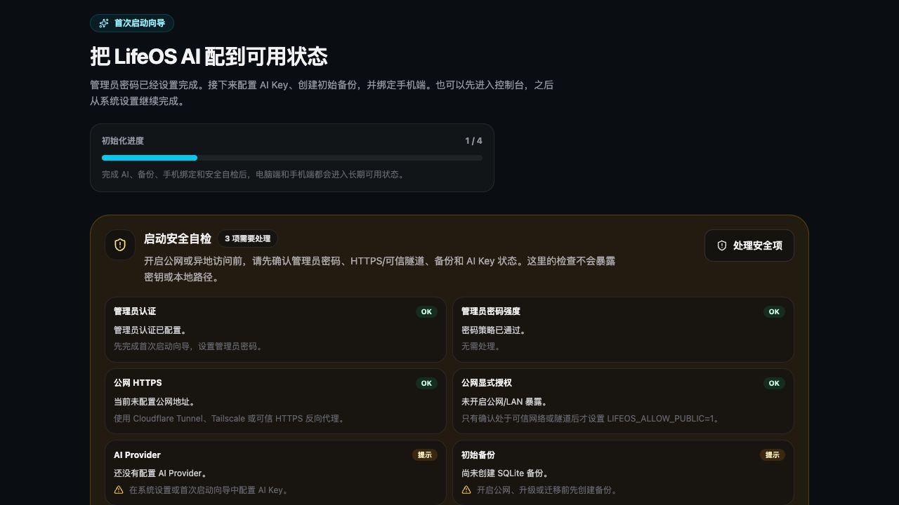
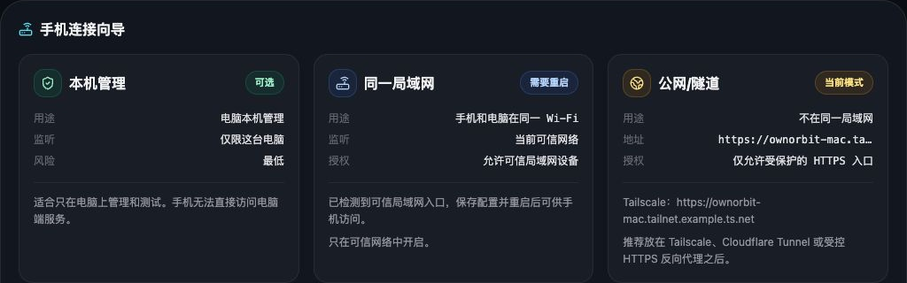
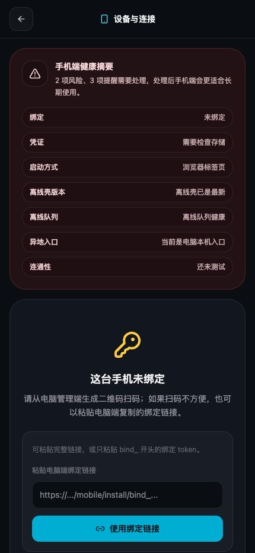
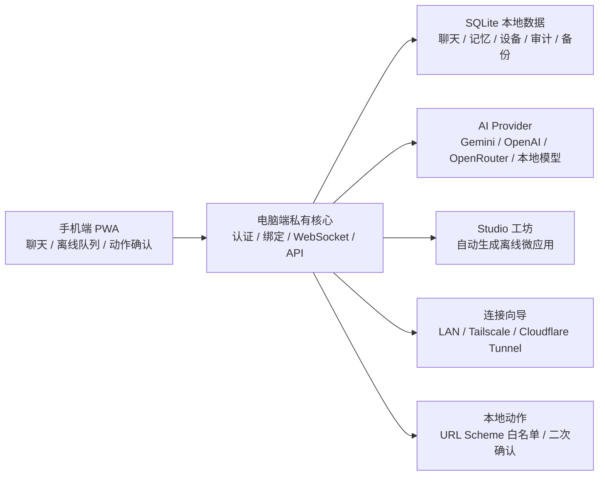

# LifeOS AI

中文 | [English](#english)

[](https://github.com/WGJ-Fry/lifeos-ai/actions/workflows/quality.yml)
[](https://github.com/WGJ-Fry/lifeos-ai/releases)
[](#许可)

**把你的电脑变成私人 AI 核心，把手机变成随身 AI 管家。**

LifeOS AI 是一个本地优先的个人 AI 管家/助手：电脑端负责运行本地核心、连接 AI 服务、保存 SQLite 数据、管理设备和安全设置；手机端通过浏览器/PWA 使用已经绑定的个性化 AI。

当前仓库已经具备可分发桌面包、移动端 PWA、管理员认证、设备绑定、SQLite 数据、备份恢复、连接向导、URL Scheme 安全控制、AI 多 provider 配置和发布校验。



<p>
  <a href="https://github.com/WGJ-Fry/lifeos-ai/releases/tag/v0.0.0"><strong>下载最新版本</strong></a>
  ·
  <a href="docs/user-install-guide.md">安装指南</a>
  ·
  <a href="docs/promotion-kit.md">推广素材</a>
  ·
  <a href="docs/faq.md">常见问题</a>
  ·
  <a href="SECURITY.md">安全说明</a>
</p>

## 亮点

- **个人 AI 管家**：电脑端做私有核心，手机端做随身入口。
- **本地优先**：聊天、记忆、设备、审计和备份统一进入本机 SQLite。
- **跨网络使用**：同 Wi-Fi 用 LAN，异地优先走 Tailscale、Cloudflare Tunnel 或可信 HTTPS 反向代理。
- **VPN/隧道向导**：自动检测局域网地址，提供 Tailscale、Cloudflare Tunnel 启动命令和桌面启动配置。
- **自动生成微应用/程序**：在 Studio 里描述想法，自动生成可运行的离线微应用，并支持继续调试 HTML/CSS/JS。
- **AI 多 provider**：支持 Gemini、OpenAI、OpenRouter、本地模型接口配置。
- **移动 PWA**：扫码绑定手机，支持离线队列、设备状态和动作权限中心。
- **安全本地动作**：导航、网页、电话、短信、邮件、快捷指令等 URL Scheme 白名单，危险动作二次确认，审计日志脱敏。
- **可安装桌面包**：macOS DMG、Windows NSIS、Linux AppImage。

## 它能帮你做什么

LifeOS AI 的目标不是再做一个普通聊天窗口，而是把个人 AI 放进一个长期可用的系统里：电脑保存你的数据、密钥和本地能力，手机负责随时调用。

| 场景 | 能力 |
| --- | --- |
| 随身个人 AI 管家 | 手机扫码绑定后作为 PWA 使用，聊天、查看设备状态、处理离线消息。 |
| 电脑私有 AI 核心 | 管理 AI provider、API Key、SQLite 数据、备份恢复、审计和安全策略。 |
| 不同网络连接 | 同 Wi-Fi 使用 LAN，异地优先使用 Tailscale、Cloudflare Tunnel 或可信 HTTPS 反向代理。 |
| 自动生成需要的程序 | 在 Studio 工坊里用自然语言描述工具，生成可运行的离线微应用，并继续编辑 HTML/CSS/JS。 |
| 调用本地能力 | 打开导航、网页、电话、短信、邮件、快捷指令等动作前先经过白名单和危险确认。 |
| 长期自用 | 备份、恢复、诊断包、迁移文件和发布校验让数据与安装包可追踪。 |

## 界面预览

下面截图来自当前真实运行的本地页面，不是概念图。

| 首次启动与安全自检 | VPN/隧道连接向导 | 手机端绑定入口 |
| --- | --- | --- |
|  |  |  |

## 下载安装

最新版本下载入口：

[下载 LifeOS AI 0.0.0 / Download LifeOS AI 0.0.0](https://github.com/WGJ-Fry/lifeos-ai/releases/tag/v0.0.0)

直接下载：

- [macOS Apple Silicon DMG](https://github.com/WGJ-Fry/lifeos-ai/releases/download/v0.0.0/LifeOS.AI-0.0.0-arm64.dmg)
- [Windows x64 Installer](https://github.com/WGJ-Fry/lifeos-ai/releases/download/v0.0.0/LifeOS.AI.Setup.0.0.0.exe)
- [Linux x64 AppImage](https://github.com/WGJ-Fry/lifeos-ai/releases/download/v0.0.0/LifeOS.AI-0.0.0.AppImage)
- [SHA256SUMS](https://github.com/WGJ-Fry/lifeos-ai/releases/download/v0.0.0/SHA256SUMS)

安装说明：

- macOS：下载 DMG，打开后拖入 Applications。
- Windows：下载安装器并运行。当前 Windows 包未配置 Authenticode 正式签名，可能出现 SmartScreen 提示。
- Linux：下载 AppImage 后执行 `chmod +x "LifeOS AI-0.0.0.AppImage"` 再运行。

完整说明见 [用户安装使用指南](docs/user-install-guide.md)。

## 当前发布状态

已生成三平台包：

| 平台 | 文件 | 状态 |
| --- | --- | --- |
| macOS Apple Silicon | `release/LifeOS AI-0.0.0-arm64.dmg` | Developer ID 签名、Apple 公证、DMG stapled |
| Windows x64 | `release/LifeOS AI Setup 0.0.0.exe` | 可安装 NSIS 包，未配置 Windows Authenticode 正式签名 |
| Linux x64 | `release/LifeOS AI-0.0.0.AppImage` | 可运行 AppImage |

发布校验：

```text
npm run release:check
165 passed, 1 warning, 0 failures
```

唯一 warning 是 `LIFEOS_UPDATE_URL` 未配置，所以当前包支持手动下载安装，暂不启用自动更新。

## 功能概览

- 电脑管理端：首次启动向导、管理员登录、仪表盘、设备绑定、AI 设置、聊天、记忆、备份恢复、诊断导出。
- 手机端 PWA：扫码绑定、移动聊天、离线队列、设备与连接状态、动作权限中心。
- 本地后端：Express API、WebSocket 实时连接、SQLite 持久化、迁移文件体系。
- AI 配置：支持 Gemini、OpenAI、OpenRouter、本地模型预留；API Key 保存在电脑端安全存储或本地加密存储。
- Studio 工坊：描述想要的功能，自动生成离线微应用/小程序；支持沙箱预览、源码复制、响应式预览、继续细化和本地持久化。
- 异地连接：内置 LAN、Tailscale、Cloudflare Tunnel、HTTPS 反向代理连接向导，生成启动环境和手机入口。
- 安全底座：HttpOnly Cookie、CSRF、登录锁定、绑定限速、设备签名/Token 迁移、危险动作确认、URL Scheme 白名单、审计日志脱敏。
- 桌面体验：Electron 启动本地核心、失败页、菜单/托盘状态、日志目录、诊断包。
- 发布链路：macOS 签名公证、Windows NSIS、Linux AppImage、update feed、SHA256SUMS、release manifest。

## 功能地图



## 普通用户安装

### macOS

下载 `LifeOS AI-0.0.0-arm64.dmg`，打开后把 `LifeOS AI` 拖入 Applications。当前 DMG 已签名并公证。

### Windows

下载 `LifeOS AI Setup 0.0.0.exe` 并运行。当前 Windows 包未配置 Authenticode 证书，Windows SmartScreen 可能提示未知发布者；请只从可信 GitHub Release 下载，并对照 `SHA256SUMS` 校验。

### Linux

下载 `LifeOS AI-0.0.0.AppImage`：

```bash
chmod +x "LifeOS AI-0.0.0.AppImage"
./"LifeOS AI-0.0.0.AppImage"
```

更多普通用户说明见 [docs/user-install-guide.md](docs/user-install-guide.md)。

## 首次使用

1. 打开电脑端 LifeOS AI。
2. 设置管理员密码。
3. 在管理端配置 AI provider 和 API Key。
4. 打开手机绑定页，用手机扫码。
5. 手机完成绑定后，再从已绑定页面添加到主屏幕。
6. 在设置中创建初始备份，并建议开启自动备份。

手机和电脑在同一局域网时，可以使用管理端推荐的 LAN 地址。异地使用建议通过 Tailscale 或 Cloudflare Tunnel，不建议直接把本地服务暴露到公网。

## 数据与隐私

默认数据保存在电脑本机 SQLite 中。桌面安装版会使用系统应用数据目录，开发模式默认使用 `data/lifeos.db`。诊断包、审计日志和导出接口会脱敏 AI Key、Token、密码、私钥、本地路径等敏感内容。

隐私说明见 [PRIVACY.md](PRIVACY.md)，安全说明见 [SECURITY.md](SECURITY.md)。

## 开发

```bash
npm install
npm run dev
```

打开：

```text
http://localhost:3000/admin/login
```

也可以启动桌面壳：

```bash
npm run desktop
```

环境变量示例见 [.env.example](.env.example)。推荐在管理端 UI 中配置 AI Key；只有开发或服务器部署时才需要 `.env.local`。

## 打包

macOS 正式签名打包前先检查签名环境：

```bash
source .env.signing.local
npm run signing:check:mac
npm run desktop:dist:mac
```

Windows/Linux 从 macOS 交叉打包时，脚本会下载对应平台 Electron：

```bash
ELECTRON_MIRROR=https://npmmirror.com/mirrors/electron/ npm run desktop:dist:win
ELECTRON_MIRROR=https://npmmirror.com/mirrors/electron/ npm run desktop:dist:linux
```

生成 update feed 和校验：

```bash
npm run release:feed
LIFEOS_DISTRIBUTION=signed npm run release:check
```

发布到 GitHub 前请阅读 [docs/github-release.md](docs/github-release.md) 和 [docs/release-assets.md](docs/release-assets.md)。

## 发布资产

当前建议上传到 GitHub Release 的文件：

```text
release/LifeOS AI-0.0.0-arm64.dmg
release/LifeOS AI Setup 0.0.0.exe
release/LifeOS AI-0.0.0.AppImage
release/SHA256SUMS
release/update-feed/latest-mac.yml
release/update-feed/latest.yml
release/update-feed/latest-linux.yml
release/update-feed/release-manifest.json
```

如果暂不启用自动更新，仍建议上传 `latest*.yml` 和 `release-manifest.json`，方便以后平滑开启。

## 文档

- [普通用户安装指南](docs/user-install-guide.md)
- [常见问题 FAQ](docs/faq.md)
- [GitHub 发布指南](docs/github-release.md)
- [发布资产清单](docs/release-assets.md)
- [桌面发布说明](docs/desktop-release.md)
- [发布前检查清单](docs/release-checklist.md)
- [回滚指南](docs/rollback.md)
- [反馈与贡献说明](CONTRIBUTING.md)
- [隐私说明](PRIVACY.md)
- [安全说明](SECURITY.md)

## 许可

当前仓库没有开放源代码许可证。除非另行添加 LICENSE，本项目默认保留所有权利。公开到 GitHub 时，其他人可以查看代码，但没有被授予复制、修改、再分发或商用授权。

---

# English

[](https://github.com/WGJ-Fry/lifeos-ai/actions/workflows/quality.yml)
[](https://github.com/WGJ-Fry/lifeos-ai/releases)
[](#license)

**Turn your desktop into a private AI core, and your phone into an always-available personal AI assistant.**

LifeOS AI is a local-first personal AI assistant built around a desktop core and a mobile PWA. The desktop app runs the local backend, connects to AI providers, stores SQLite data, manages devices and security settings, and serves the mobile experience. The phone uses a browser/PWA after pairing.

## Highlights

- **Personal AI assistant**: the desktop runs the private core; the phone becomes the daily companion.
- **Local-first data**: chats, memories, devices, audits, and backups live in local SQLite.
- **Away-from-home access**: use LAN on the same Wi-Fi, or Tailscale, Cloudflare Tunnel, or a trusted HTTPS reverse proxy remotely.
- **VPN/tunnel guide**: detects LAN addresses and provides Tailscale / Cloudflare Tunnel commands and desktop startup configuration.
- **AI-generated micro apps**: describe what you need in Studio, generate a runnable offline micro app, then refine HTML/CSS/JS in the sandbox.
- **Multi-provider AI**: configure Gemini, OpenAI, OpenRouter, and local model endpoints.
- **Mobile PWA**: pair by QR code, then use chat, offline queue, device status, and action permissions.
- **Safer local actions**: navigation, web, phone, SMS, mail, shortcuts, and other URL Schemes are allowlisted, confirmed, and audited.
- **Installable desktop builds**: macOS DMG, Windows NSIS, and Linux AppImage.

## What It Helps You Do

LifeOS AI is not just another chat box. It is a long-lived personal AI system: your desktop keeps the data, keys, network access, and local capabilities; your phone becomes the everyday companion.

| Scenario | Capability |
| --- | --- |
| Personal AI on your phone | Pair the mobile PWA, chat, view device state, and keep offline messages queued. |
| Private desktop AI core | Manage AI providers, API keys, SQLite data, backup/restore, audits, and safety settings. |
| Remote access | Use LAN on the same Wi-Fi, or Tailscale, Cloudflare Tunnel, or a trusted HTTPS reverse proxy away from home. |
| Generate small tools | Describe a workflow in Studio, generate an offline micro app, then refine HTML/CSS/JS. |
| Safer local actions | Open maps, web pages, phone, SMS, mail, and shortcuts only through allowlists and confirmations. |
| Long-term use | Backups, restore tasks, diagnostics, migrations, and release checks make the system maintainable. |

## Download And Install

Latest release:

[Download LifeOS AI 0.0.0](https://github.com/WGJ-Fry/lifeos-ai/releases/tag/v0.0.0)

Direct downloads:

- [macOS Apple Silicon DMG](https://github.com/WGJ-Fry/lifeos-ai/releases/download/v0.0.0/LifeOS.AI-0.0.0-arm64.dmg)
- [Windows x64 Installer](https://github.com/WGJ-Fry/lifeos-ai/releases/download/v0.0.0/LifeOS.AI.Setup.0.0.0.exe)
- [Linux x64 AppImage](https://github.com/WGJ-Fry/lifeos-ai/releases/download/v0.0.0/LifeOS.AI-0.0.0.AppImage)
- [SHA256SUMS](https://github.com/WGJ-Fry/lifeos-ai/releases/download/v0.0.0/SHA256SUMS)

Install notes:

- macOS: download the DMG, open it, and drag LifeOS AI into Applications.
- Windows: download and run the installer. This build is not Authenticode signed yet, so SmartScreen may warn about an unknown publisher.
- Linux: download the AppImage, run `chmod +x "LifeOS AI-0.0.0.AppImage"`, then open it.

See [User Install Guide](docs/user-install-guide.md) for details.

## Release Status

Three desktop artifacts have been generated:

| Platform | File | Status |
| --- | --- | --- |
| macOS Apple Silicon | `release/LifeOS AI-0.0.0-arm64.dmg` | Developer ID signed, Apple notarized, DMG stapled |
| Windows x64 | `release/LifeOS AI Setup 0.0.0.exe` | Installable NSIS package, not Authenticode signed yet |
| Linux x64 | `release/LifeOS AI-0.0.0.AppImage` | Runnable AppImage |

Release gate:

```text
npm run release:check
165 passed, 1 warning, 0 failures
```

The only warning is that `LIFEOS_UPDATE_URL` is not configured, so packaged apps currently support manual download/install but not automatic updates.

## Highlights

- Desktop admin: onboarding, admin auth, dashboard, device pairing, AI settings, chat, memory, backup/restore, diagnostics.
- Mobile PWA: QR pairing, mobile chat, offline queue, device/connection status, action permission center.
- Local backend: Express API, WebSocket realtime, SQLite persistence, migration files.
- AI configuration: Gemini, OpenAI, OpenRouter, and local-model-ready provider model.
- Studio workshop: describe a tool or workflow and generate a sandboxed offline micro app, with source editing and responsive preview.
- Remote connectivity: LAN, Tailscale, Cloudflare Tunnel, and trusted HTTPS reverse-proxy guide with generated launch commands and mobile URLs.
- Security baseline: HttpOnly cookies, CSRF, login lockout, pairing rate limits, device signature/token migration, dangerous action confirmation, URL Scheme allowlist, redacted audit logs.
- Desktop app: Electron local core startup, startup failure page, tray/menu status, logs folder, diagnostic bundle.
- Release chain: macOS signing/notarization, Windows NSIS, Linux AppImage, update feed, SHA256SUMS, release manifest.

## Install

### macOS

Download `LifeOS AI-0.0.0-arm64.dmg`, open it, and drag `LifeOS AI` into Applications. The current DMG is signed and notarized.

### Windows

Download and run `LifeOS AI Setup 0.0.0.exe`. The current Windows package is not Authenticode signed, so SmartScreen may warn about an unknown publisher. Only install from a trusted GitHub Release and verify `SHA256SUMS`.

### Linux

Download `LifeOS AI-0.0.0.AppImage`:

```bash
chmod +x "LifeOS AI-0.0.0.AppImage"
./"LifeOS AI-0.0.0.AppImage"
```

See [docs/user-install-guide.md](docs/user-install-guide.md) for end-user instructions.

## First Run

1. Open the desktop app.
2. Set the administrator password.
3. Configure an AI provider and API key.
4. Open the phone pairing page and scan the QR code.
5. Add the PWA to the phone home screen only after pairing succeeds.
6. Create an initial backup and enable automatic backups.

For remote phone access, prefer Tailscale or Cloudflare Tunnel. Do not expose the local core directly to the public internet without HTTPS and an explicit security review.

## Development

```bash
npm install
npm run dev
```

Open:

```text
http://localhost:3000/admin/login
```

Desktop shell:

```bash
npm run desktop
```

## Packaging

macOS signing check:

```bash
source .env.signing.local
npm run signing:check:mac
npm run desktop:dist:mac
```

Windows and Linux:

```bash
ELECTRON_MIRROR=https://npmmirror.com/mirrors/electron/ npm run desktop:dist:win
ELECTRON_MIRROR=https://npmmirror.com/mirrors/electron/ npm run desktop:dist:linux
```

Generate feed and verify:

```bash
npm run release:feed
LIFEOS_DISTRIBUTION=signed npm run release:check
```

Read [docs/github-release.md](docs/github-release.md) and [docs/release-assets.md](docs/release-assets.md) before uploading to GitHub Releases.
