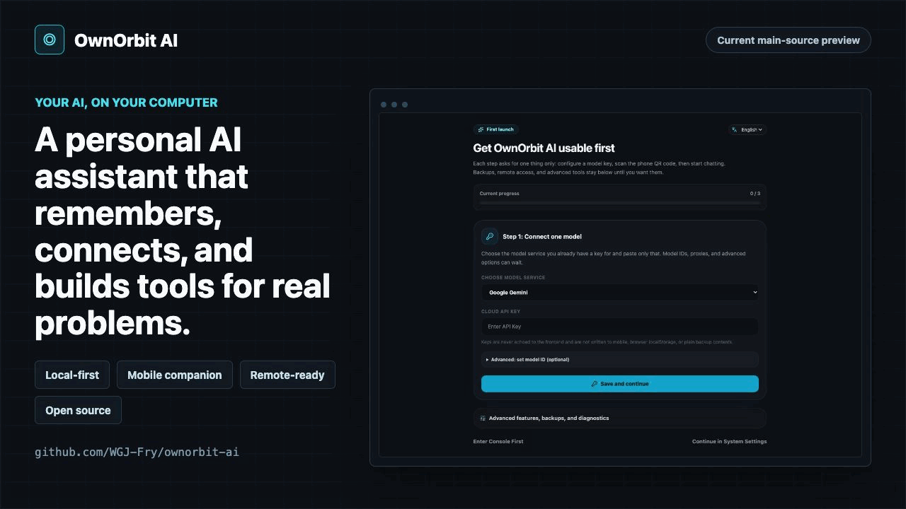
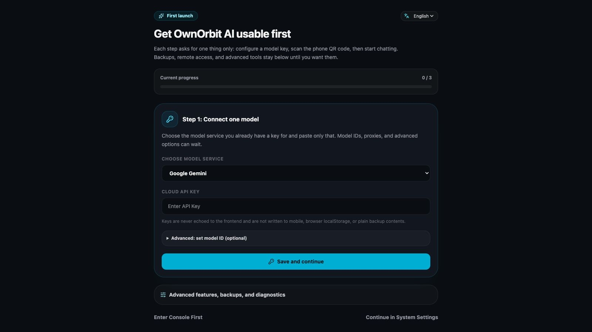
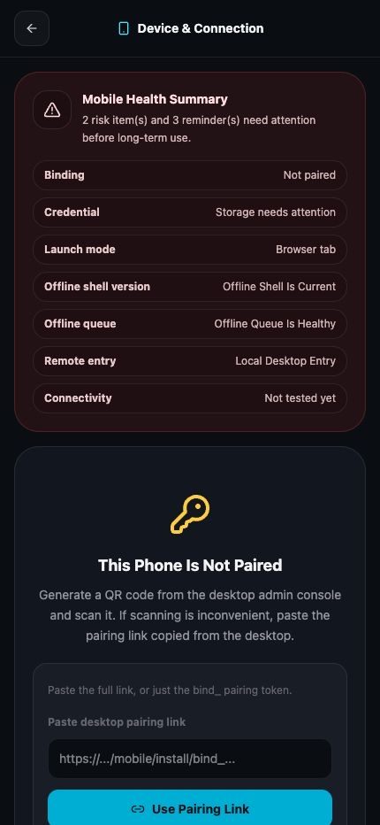
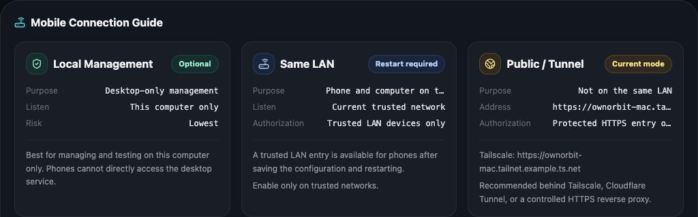
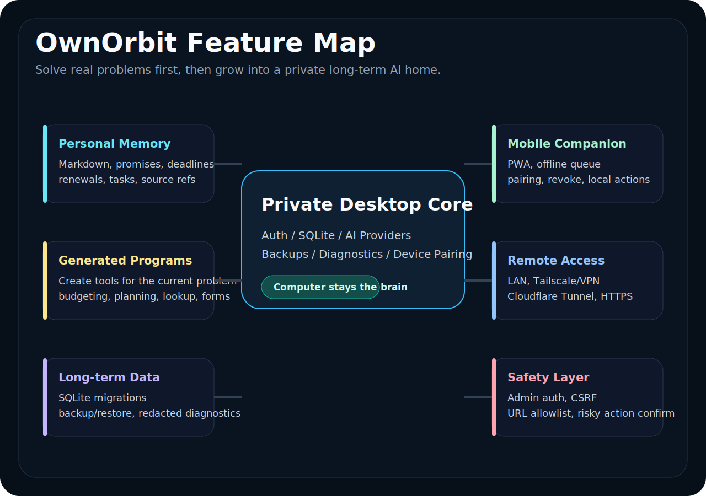
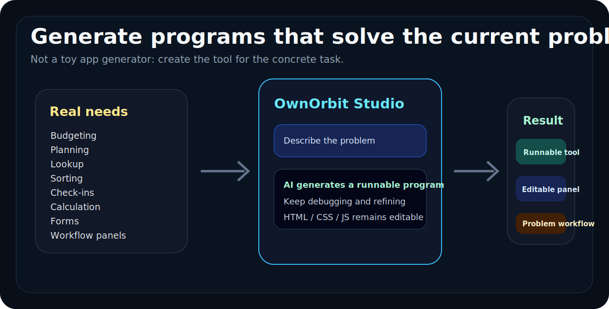
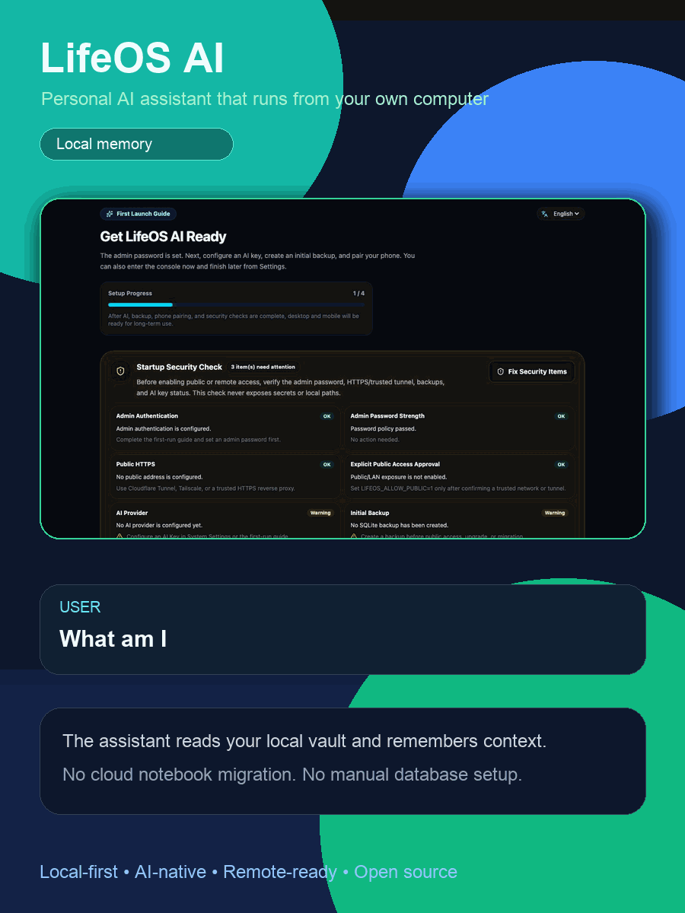
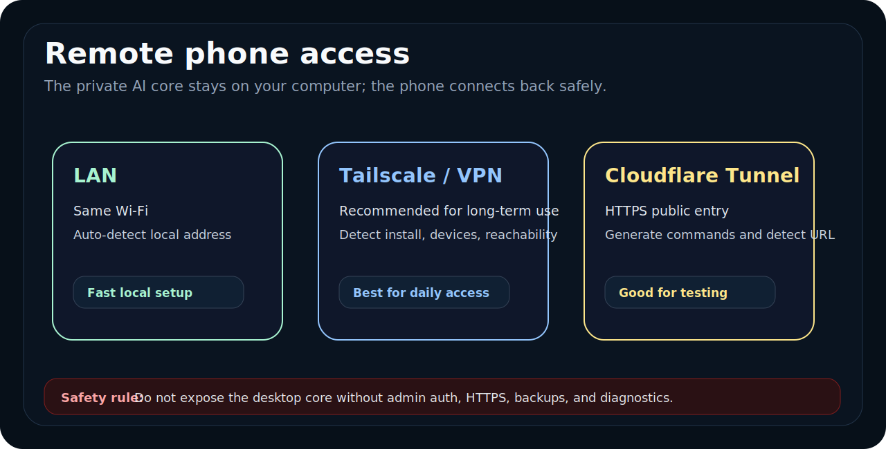

# OwnOrbit AI - Open-Source, Local-First Personal AI Assistant

> **A self-hosted personal AI assistant for private memory, everyday action, and generated problem-solving tools.**
>
> Your computer runs the private AI core. Your phone becomes the paired mobile companion.

OwnOrbit AI is an open-source, self-hosted, local-first personal AI assistant and private second brain. It combines local Markdown knowledge, user-selected LLM providers, a desktop admin core, a mobile PWA, safer remote access through LAN/Tailscale/Cloudflare Tunnel, and runnable tools generated for the problem you are solving. It is built for macOS, Windows, and Linux, with an experimental native Apple/CloudKit data-sync path under active development.

[中文说明](README.zh-CN.md) | [Release Status](#release-status) | [Setup](#2-minute-setup) | [Generated Programs](#generated-problem-solving-programs) | [Remote Access](#remote--vpn-access) | [Current Limits](#current-alpha-limits)

[](https://github.com/WGJ-Fry/ownorbit-ai/actions/workflows/quality.yml)
[](https://github.com/WGJ-Fry/ownorbit-ai/actions/workflows/docker.yml)
[](https://github.com/WGJ-Fry/ownorbit-ai/releases)
[](LICENSE)

> [!NOTE]
> **LifeOS AI is now OwnOrbit AI.** The public `v0.1.5-alpha` files and GHCR image still use the former name. Existing `LIFEOS_*` settings, app identity, local data, device bindings, and iCloud handoff files remain compatible. See the [brand migration notes](docs/brand-migration.md).

<p align="center">
  
</p>

OwnOrbit starts with one small but useful workflow:

```text
What am I forgetting?
```

It reads local Markdown notes, runs with local Ollama in the alpha demo, and surfaces commitments, deadlines, renewals, and unfinished work that might otherwise slip through the cracks.

## 10-Second Summary

- **Open-source and self-hosted:** run the private core on hardware you control.
- **Local Markdown memory:** reads `.md` files from a folder you control.
- **Fastest demo path:** Docker Compose + Ollama `llama3.2`.
- **Desktop admin:** setup, AI provider settings, backup/restore, diagnostics, and device pairing.
- **Mobile PWA:** paired phone chat, offline queue, device status, and action permission center.
- **Connection guide:** LAN, Tailscale, and Cloudflare Tunnel diagnostics with safety checks.
- **Studio tools:** generate and refine runnable problem-solving programs with state storage, runtime logs, and rollback.

Current release promise: put Markdown notes in a folder, run OwnOrbit locally, and ask what you may have missed.

## Release Status

Public release tag: [`v0.1.5-alpha`](https://github.com/WGJ-Fry/ownorbit-ai/releases/tag/v0.1.5-alpha)<br>
Source package version: `0.1.5-alpha.0`

This README is written for the public `v0.1.5-alpha` downloads. The `main` branch may contain later source-only changes; use those only if you are comfortable building from source.

Important: use the explicit [`v0.1.5-alpha` Release page](https://github.com/WGJ-Fry/ownorbit-ai/releases/tag/v0.1.5-alpha). If GitHub's generic **Latest release** label ever points to an older build, ignore it and use this versioned link.

| Track | What to expect |
| --- | --- |
| `v0.1.5-alpha` public release | Docker Compose local Markdown + read-only `.ics` memory demo, GHCR image path, macOS unsigned ZIP, Windows NSIS installer, Linux AppImage, admin auth, AI provider settings, mobile PWA pairing, offline queue with idempotent replay and conflict-review guidance, SQLite migrations, backup/restore, diagnostics, release checks, connection diagnostics, Studio blueprint confirmation/template/permission/repair guidance plus readiness/quality scoring, and opt-in Apple Calendar, Google Calendar/Tasks, and system Reminders connector paths guarded by explicit admin confirmation, audit logs, write history, and rollback status. |
| Current `main` source | Developer path only. It may contain later source changes after the tagged release; use it only if you are comfortable building from source. |
| Earlier base | `0.1.1-alpha.0` added Docker quickstart/Ollama/Markdown vault defaults. `0.1.0` started the desktop/PWA foundation. |

## Choose Your Path

| Path | Use this when | Current public status |
| --- | --- | --- |
| **Docker Compose alpha** | You want the fastest local demo with Ollama and Markdown notes. | Recommended first try. Uses `ghcr.io/wgj-fry/lifeos-ai:v0.1.5-alpha`. |
| **macOS desktop ZIP** | You want to try the early desktop shell on Apple Silicon. | Available in the [`v0.1.5-alpha` Release](https://github.com/WGJ-Fry/ownorbit-ai/releases/tag/v0.1.5-alpha): `LifeOS.AI-0.1.5-alpha.0-arm64-unsigned.zip`. |
| **Windows desktop installer** | You want a native Windows x64 installer. | Available in the [`v0.1.5-alpha` Release](https://github.com/WGJ-Fry/ownorbit-ai/releases/tag/v0.1.5-alpha): `LifeOS.AI.Setup.0.1.5-alpha.0.exe`. |
| **Linux AppImage** | You want a portable Linux x64 desktop package. | Available in the [`v0.1.5-alpha` Release](https://github.com/WGJ-Fry/ownorbit-ai/releases/tag/v0.1.5-alpha): `LifeOS.AI-0.1.5-alpha.0.AppImage`. |

If you are new, start with Docker Compose below. If you specifically want the desktop app, use the `v0.1.5-alpha` Release and verify downloads with `SHA256SUMS` before first launch. GitHub asset URLs use dot-separated filenames, while `SHA256SUMS` may list the original builder filenames with spaces; compare the SHA256 value if the local filename differs.

The `v0.1.5-alpha` filenames above are the real historical download names from before the rename. Future OwnOrbit-branded builds use `OwnOrbit AI` filenames. Always compare the SHA256 value when a browser or upload step changes spaces to dots.

## Real Product Screens

These are real screens from the current project, not concept art.

### 30-Second Product Video

This bilingual visual walkthrough was regenerated from the current `main` source UI and now uses the OwnOrbit brand throughout. The public `v0.1.5-alpha` installers still keep their historical filenames until the next desktop package is published.

<p align="center">
  <a href="docs/assets/promo/ownorbit-ai-30s-en.mp4">
    
  </a>
</p>

<p align="center">
  <a href="docs/assets/promo/ownorbit-ai-30s-en.mp4">Watch MP4 video</a>
  ·
  <a href="docs/assets/promo/ownorbit-ai-30s-en-cover.png">Download cover image</a>
</p>

<p align="center">
  
  
</p>

<p align="center">
  
</p>

## Why OwnOrbit AI

Most AI tools wait for you to remember the right prompt. OwnOrbit starts from the mess you already have: scattered notes, dates, promises, renewals, ideas, and unfinished work.

OwnOrbit is interesting because the current alpha already combines three working pieces:

1. **Memory discovery:** find forgotten commitments and deadlines from your own data.
2. **Local-first AI:** keep the first useful workflow on your machine with a local Ollama model.
3. **Generated tools:** create, refine, save, and roll back small runnable tools inside Studio.

## Feature Map

<p align="center">
  
</p>

| Area | Current status |
| --- | --- |
| Local memory reading | Markdown plus optional read-only `.ics` calendar/task files in the Docker/local path |
| Ollama local model | Works through Docker Compose |
| “What am I forgetting?” chat | Works for mounted Markdown notes plus upcoming `.ics` events and open `.ics` tasks |
| Admin login and security diagnostics | Included in the desktop/server path |
| Desktop app shell | Available as current alpha packages |
| Mobile companion | Pairing, chat, offline queue, device status, and action permissions are implemented |
| Remote access guidance | LAN, Tailscale, Cloudflare Tunnel diagnostics and safety checks are implemented |
| Generated programs | Studio generation, refinement, runtime logs, debug instruction, state storage, rollback, blueprint confirmation, expanded template variants, readiness/quality scoring, permission notes, guarded repair boundaries, and failure recovery guidance. |

## Generated Problem-Solving Programs

<p align="center">
  
</p>

OwnOrbit Studio turns a concrete need into a small runnable program.

This is not just “generate an app from a prompt.” The goal is more practical:

> In Studio, enter a concrete problem. OwnOrbit generates a focused tool that helps you work through it.

The current source also shows the generated-program blueprint before creation: what the user should confirm, what permissions/boundaries the helper should keep, and how to repair or regenerate when the first version misses the task.

Examples:

- A renewal tracker from scattered subscription notes.
- A trip checklist from messages and plans.
- A budget calculator for a specific month.
- A follow-up board for people you promised to contact.
- A tiny workflow panel for repeated local actions.

Status: generation, manual refinement, durable state, runtime logs, debug instruction generation, action permission checks, template matching, readiness/quality scoring, guarded repair boundaries, and version rollback are implemented in the public release path. Fully automatic unattended self-repair is not advertised here.

## 2-Minute Setup

Requirements:

- Git
- Docker
- Docker Compose

```bash
git clone https://github.com/WGJ-Fry/ownorbit-ai.git
cd ownorbit-ai

mkdir -p lifeos_vault lifeos_data

cat > lifeos_vault/demo.md <<'EOF'
# Demo memory

- Passport expires in 47 days.
- Project proposal for Tom is due tomorrow.
- Tax filing deadline is in 12 days.
EOF

docker compose up -d
```

Open:

```text
http://localhost:8080/admin/login
```

Demo password:

```text
lifeos-local-demo
```

This password is only for the local Docker quickstart, where the app is bound to `127.0.0.1`. Change `LIFEOS_ADMIN_PASSWORD` before any LAN, VPN, tunnel, or public exposure test.

Ask:

```text
What am I forgetting?
```

Expected result: OwnOrbit should mention the passport expiry, Tom’s proposal, and the tax filing deadline from `lifeos_vault/demo.md`.

The command setup is short, but first startup can take several minutes because Ollama downloads `llama3.2`.

<p align="center">
  
</p>

## What Starts In Docker

| Service | Purpose |
| --- | --- |
| `ollama` | Runs the local model server. |
| `ollama-pull` | Downloads `llama3.2` once before OwnOrbit starts. |
| `lifeos` | Runs the OwnOrbit web UI and API server. |

The default Compose file binds OwnOrbit to the local computer:

```text
127.0.0.1:8080 -> lifeos:3000
```

This Docker quickstart is for a local browser demo. It does not automatically make the system reachable from your phone outside the local machine.

Do not remove the `127.0.0.1` host binding unless you have already set a strong admin password and understand the remote-access warning in the connection guide.

## Remote & VPN Access

<p align="center">
  
</p>

OwnOrbit is designed for this model:

```text
Your computer = private AI core
Your phone = companion client
Connection = LAN, VPN, or a carefully configured tunnel
```

| Mode | Best for | Notes |
| --- | --- | --- |
| Same Wi-Fi / LAN | Quick phone testing at home | Phone and computer must be on the same network. |
| Tailscale / VPN | Recommended personal remote access | Safer long-term option because the service stays private to your devices. |
| Cloudflare Tunnel | HTTPS remote testing | Useful, but should be configured carefully with auth and public exposure warnings. |
| Direct public port | Not recommended | Do not expose the desktop core directly to the internet. |

Safety rule: before remote access, enable admin auth, use HTTPS or a private VPN path, understand which URL is public, and keep backups/diagnostics available.

### Phone Outside Home: 3 Steps

Entry point: desktop admin -> device pairing / connection guide.

1. Start OwnOrbit on the computer and finish the admin setup.
2. Use the connection guide to pick a private VPN URL, LAN URL, or carefully configured HTTPS tunnel URL.
3. Generate the pairing QR from that selected URL, scan it on the phone, then run the built-in reachability check before relying on it outside the local network.

Recommended long-term path: Tailscale or another private VPN. Cloudflare Tunnel is useful for HTTPS testing, but should not be treated as “safe by default” unless access control is configured.

## Local Memory Contract

OwnOrbit reads your mounted Markdown folder and, optionally, local `.ics` calendar/task files. It does not write back to the vault, calendar files, or task files in this alpha path.

| Item | Current behavior |
| --- | --- |
| Host folder | `./lifeos_vault` |
| Container path | `/app/vault` |
| Markdown files | `.md` |
| Optional calendar/task files | `.ics` under `./lifeos_vault/calendar`, supporting `VEVENT` and open `VTODO` items |
| Hidden folders | Skipped |
| `node_modules` | Skipped |
| Default max files | `30` |
| Default chars per file | `3000` |
| Default total chars | `60000` |
| Calendar/task behavior | Read-only upcoming events and open dated tasks, no account sync, no write-back |

Relevant environment variables:

```text
LIFEOS_VAULT_DIR=/app/vault
LIFEOS_VAULT_MAX_FILES=30
LIFEOS_VAULT_MAX_CHARS_PER_FILE=3000
LIFEOS_VAULT_MAX_TOTAL_CHARS=60000
LIFEOS_CALENDAR_ICS_DIR=/app/vault/calendar
LIFEOS_CALENDAR_MAX_FILES=10
LIFEOS_CALENDAR_MAX_EVENTS=20
LIFEOS_CALENDAR_LOOKAHEAD_DAYS=90
```

## AI Providers

The Docker alpha uses local Ollama by default:

```text
LIFEOS_ACTIVE_AI_PROVIDER=local
LOCAL_MODEL_NAME=llama3.2
LOCAL_MODEL_BASE_URL=http://ollama:11434/v1
```

The desktop/admin path includes provider settings for Mainland China and international models: DeepSeek, Qwen/DashScope, Kimi, GLM, Qianfan/ERNIE, Hunyuan, Doubao, MiniMax, StepFun, SiliconFlow, Baichuan, OpenAI, Gemini, Claude, Mistral, Groq, Perplexity, Together, xAI Grok, OpenRouter, and local OpenAI-compatible endpoints. Built-in model IDs are only the starting catalog: the UI can refresh `/models` where supported and also lets you type a newly released model ID manually. Sensitive keys are intended to stay server-side and out of frontend storage, backups, logs, and API responses.

## Current Alpha Limits

OwnOrbit is alpha software. The Docker quickstart is the most stable demo path; desktop, mobile, remote access, and Studio are usable alpha paths with more moving parts.

- Automatic updates are not enabled yet; update manually from GitHub Releases and verify `SHA256SUMS`.
- The public desktop packages are unsigned alpha builds. macOS Developer ID signing/notarization and Windows Authenticode signing are not part of this release, so Gatekeeper or SmartScreen may warn.
- Remote diagnostics can verify configuration, but long-term remote stability still needs real-device evidence: cellular data, Wi-Fi switching, desktop restart recovery, stale QR repair, and tunnel interruption recovery.
- iCloud Drive still syncs only mobile entry files by default. The opt-in CloudKit native candidate can mirror selected chat, memory, task, generated-app-state, and device-trust metadata records through explicit confirmations, quarantine review, and conservative apply rules; it does not sync raw device credentials, AI keys, SQLite databases, or backups. See [iCloud data sync design boundary](docs/icloud-data-sync-design.md).
- Local memory reads Markdown plus optional read-only `.ics` calendar/task files in the Docker/local path.
- Broad Apple Calendar, Google Calendar, and system reminders account sync is not shipped yet. `v0.1.5-alpha` only adds narrow Apple Calendar, Google Calendar/Tasks, and system reminders connector paths that must be explicitly enabled and confirmed by an admin before writing outside OwnOrbit; writes are audited, recorded in SQLite history, and expose guarded rollback status.
- `.ics` support is read-only local ingestion, not two-way calendar/task management.
- Calendar/task write-back is limited to the guarded connector paths and is not advertised as unattended background sync.
- Not a perfect deadline detector.
- Reads a limited number of files for speed and context size.
- Studio generated programs remain alpha: blueprints, templates, readiness/quality scoring, permission notes, logs, state, repair guidance, guarded repair boundaries, and rollback exist, but fully automatic unattended repair is not advertised.
- Local actions are still URL Scheme / browser / Shortcuts bridge flows, not full native OS automation.
- Desktop, mobile, remote access, and Studio generated programs should be validated against the release notes before public demos.

## Troubleshooting

Check containers:

```bash
docker compose ps
```

View logs:

```bash
docker compose logs -f ollama
docker compose logs -f lifeos
```

Restart from scratch:

```bash
docker compose down -v
rm -rf lifeos_data lifeos_vault
```

Common issues:

- **The page is not ready yet:** wait for `ollama-pull` to finish downloading `llama3.2`.
- **Port conflict:** change the host side of `127.0.0.1:8080:3000` in `docker-compose.yml`.
- **The answer ignores the demo notes:** confirm `lifeos_vault/demo.md` exists before starting Compose.

## Development

```bash
npm ci
npm run build
npm test
```

Quality gate:

```bash
npm run quality:gate
```

Docker image:

```text
ghcr.io/wgj-fry/lifeos-ai:v0.1.5-alpha
```

Note: the release tag is `v0.1.5-alpha`; the package version is `0.1.5-alpha.0`.

## License

MIT
