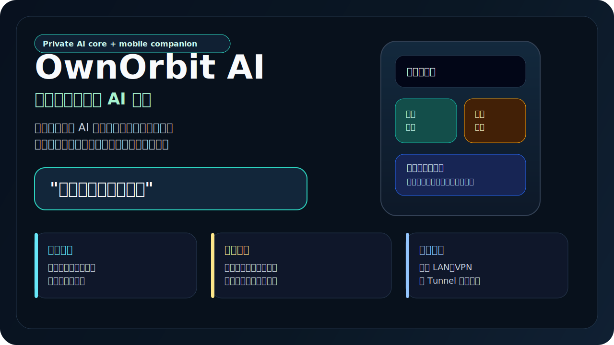
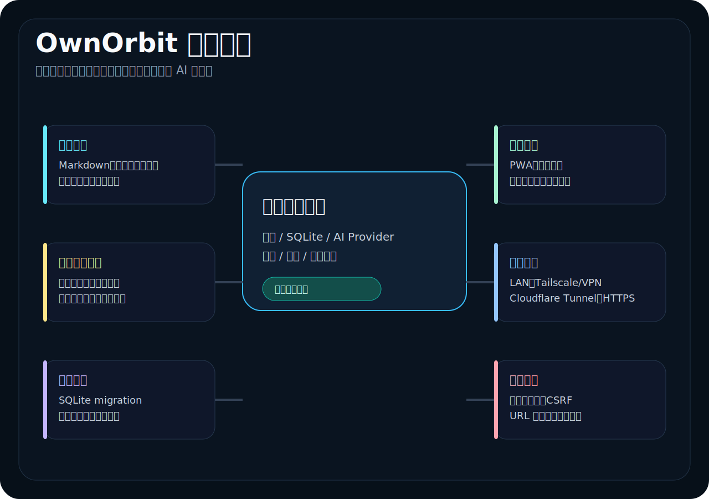
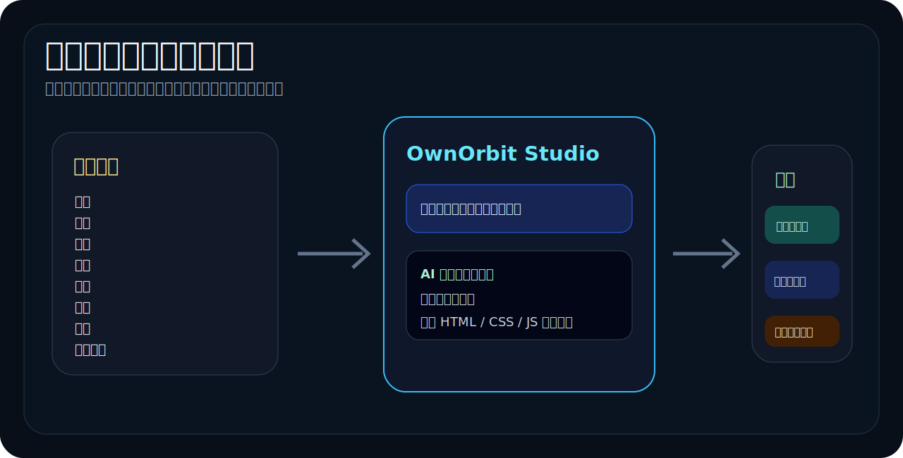
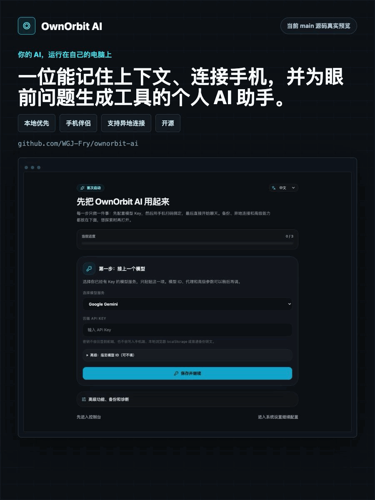
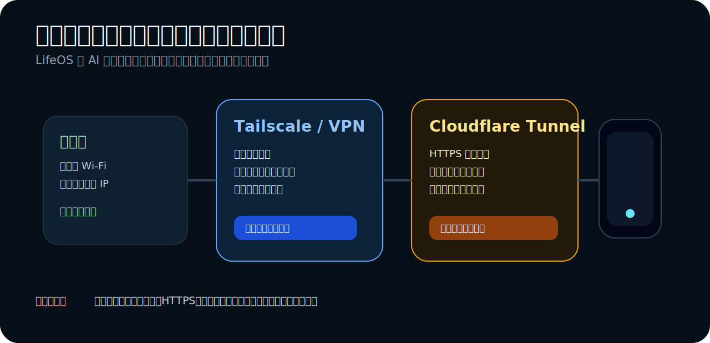

# LifeOS AI

> **一个本地优先的个人 AI 系统：记忆、行动和自动生成解决问题的程序。**
>
> 电脑端运行私有 AI 核心，手机端成为日常使用入口。

[English](README.md) | [发布状态](#发布状态) | [快速配置](#2-分钟配置) | [自动生成程序](#自动生成解决问题的程序) | [远程访问](#远程与-vpn-访问) | [当前限制](#当前-alpha-限制)

[](https://github.com/WGJ-Fry/lifeos-ai/actions/workflows/quality.yml)
[](https://github.com/WGJ-Fry/lifeos-ai/actions/workflows/docker.yml)
[](https://github.com/WGJ-Fry/lifeos-ai/releases)
[](LICENSE)

<p align="center">
  
</p>

LifeOS 先从一个很小但有用的工作流开始：

```text
我是不是忘了什么？
```

它读取本地 Markdown 笔记，在 alpha 演示里使用本地 Ollama 运行，并从笔记里找出可能被遗漏的承诺、截止日期、续期事项和未完成任务。

## 10 秒看懂

- **本地 Markdown 记忆：** 读取你自己控制的 `.md` 文件夹。
- **最快演示路径：** Docker Compose + Ollama `llama3.2`。
- **电脑端管理：** 首次设置、AI provider、备份恢复、诊断、设备绑定。
- **手机端 PWA：** 绑定聊天、离线队列、设备状态、动作权限中心。
- **连接向导：** LAN、Tailscale、Cloudflare Tunnel 诊断与安全检查。
- **Studio 工具：** 生成并改写可运行程序，支持状态存储、运行日志和回滚。

当前公开版本的承诺很克制：把 Markdown 笔记放进文件夹，本地启动 LifeOS，然后问它你可能漏掉了什么。

## 发布状态

公开 Release tag：[`v0.1.5-alpha`](https://github.com/WGJ-Fry/lifeos-ai/releases/tag/v0.1.5-alpha)<br>
源码 package version：`0.1.5-alpha.0`

这份 README 面向 `v0.1.5-alpha` 公开下载包。`main` 分支可能包含后续源码改动；只有你愿意从源码构建时，才需要关注它。

重要：请使用明确的 [`v0.1.5-alpha` Release 页面](https://github.com/WGJ-Fry/lifeos-ai/releases/tag/v0.1.5-alpha)。如果 GitHub 通用的 **Latest release** 标签仍指向旧版本，请忽略它，使用这个带版本号的链接。

| 轨道 | 可以期待什么 |
| --- | --- |
| `v0.1.5-alpha` 公开发布版 | Docker Compose 本地 Markdown + 只读 `.ics` 记忆演示、GHCR 镜像路径、macOS unsigned ZIP、Windows NSIS 安装包、Linux AppImage、管理员认证、AI provider 设置、手机 PWA 绑定、带幂等重放和冲突复核提示的离线队列、SQLite migration、备份恢复、诊断包、发布检查、连接诊断、Studio 蓝图确认/模板/权限/修复提示和就绪/质量评分，以及由管理员显式确认的 Apple Calendar、Google Calendar/Tasks、系统提醒事项连接器路径、审计日志、写入历史和回滚状态。 |
| 当前 `main` 源码 | 仅面向开发者。它可能包含 tag 发布之后的源码变化；只有你愿意从源码构建时才需要关注。 |
| 更早基础版本 | `0.1.1-alpha.0` 增加 Docker quickstart/Ollama/Markdown vault 默认路径。`0.1.0` 建立桌面/PWA 底座。 |

## 选择你的体验路径

| 路径 | 适合你在什么时候用 | 当前公开状态 |
| --- | --- | --- |
| **Docker Compose alpha** | 想最快体验 Ollama + Markdown 本地记忆演示。 | 推荐第一次体验使用。镜像是 `ghcr.io/wgj-fry/lifeos-ai:v0.1.5-alpha`。 |
| **macOS 桌面 ZIP** | 想在 Apple Silicon Mac 上试用早期桌面端壳。 | 已在 [`v0.1.5-alpha` Release](https://github.com/WGJ-Fry/lifeos-ai/releases/tag/v0.1.5-alpha) 提供：`LifeOS.AI-0.1.5-alpha.0-arm64-unsigned.zip`。 |
| **Windows 桌面安装包** | 想要 Windows x64 原生安装器。 | 已在 [`v0.1.5-alpha` Release](https://github.com/WGJ-Fry/lifeos-ai/releases/tag/v0.1.5-alpha) 提供：`LifeOS.AI.Setup.0.1.5-alpha.0.exe`。 |
| **Linux AppImage** | 想要 Linux x64 便携桌面包。 | 已在 [`v0.1.5-alpha` Release](https://github.com/WGJ-Fry/lifeos-ai/releases/tag/v0.1.5-alpha) 提供：`LifeOS.AI-0.1.5-alpha.0.AppImage`。 |

如果你是第一次看这个项目，建议从下面的 Docker Compose 开始。如果你明确想试桌面 App，请使用 `v0.1.5-alpha` Release，并在首次启动前用 `SHA256SUMS` 校验下载文件。GitHub 下载资产名使用点号，`SHA256SUMS` 里可能保留构建器生成的空格文件名；如果本地文件名不同，直接比对 SHA256 值即可。

校验文件名对照：GitHub 可能显示 `LifeOS.AI-0.1.5-alpha.0-arm64-unsigned.zip`、`LifeOS.AI.Setup.0.1.5-alpha.0.exe`、`LifeOS.AI-0.1.5-alpha.0.AppImage`；构建器元数据可能显示 `LifeOS AI-0.1.5-alpha.0-arm64-unsigned.zip`、`LifeOS AI Setup 0.1.5-alpha.0.exe`、`LifeOS AI-0.1.5-alpha.0.AppImage`。

## 真实产品界面

下面是真实项目截图，不是概念图。

### 30 秒产品视频

<p align="center">
  <a href="docs/assets/promo/lifeos-ai-30s-zh.mp4">
    
  </a>
</p>

<p align="center">
  <a href="docs/assets/promo/lifeos-ai-30s-zh.mp4">观看 MP4 视频</a>
  ·
  <a href="docs/assets/promo/lifeos-ai-30s-zh-cover.png">下载封面图</a>
</p>

<p align="center">
  
  
</p>

<p align="center">
  
</p>

## 为什么是 LifeOS AI

很多 AI 工具等你想起正确的问题。LifeOS 面向的是你已经拥有的混乱现实：散落的笔记、日期、承诺、续期、想法和未完成事项。

LifeOS 有意思的地方在于当前 alpha 已经把三件事放在一起：

1. **记忆发现：** 从你自己的数据里找出可能忘掉的承诺和截止日期。
2. **本地优先 AI：** 第一个可用工作流在你自己的电脑上用 Ollama 本地模型运行。
3. **生成工具：** 在 Studio 里创建、改写、保存和回滚小型可运行工具。

## 功能地图

<p align="center">
  
</p>

| 模块 | 当前状态 |
| --- | --- |
| 本地记忆读取 | Docker/local 路径可读取 Markdown，并可选读取本地 `.ics` 日历/任务文件 |
| Ollama 本地模型 | 通过 Docker Compose 可用 |
| “我是不是忘了什么？”聊天 | 可基于挂载的 Markdown 笔记、本地 `.ics` 未来日程和未完成待办回答 |
| 管理员登录和安全诊断 | 桌面端/server 路径已包含 |
| 桌面端壳 | 当前 alpha 包已提供 |
| 手机端伴侣 | 已实现绑定、聊天、离线队列、设备状态和动作权限 |
| 远程访问向导 | 已实现 LAN、Tailscale、Cloudflare Tunnel 诊断和安全检查 |
| 自动生成程序 | Studio 已包含生成、改写、运行日志、调试指令、状态存储、回滚、蓝图确认、扩展模板变体、就绪/质量评分、权限说明、带护栏修复边界和失败修复建议。 |

## 自动生成解决问题的程序

<p align="center">
  
</p>

LifeOS Studio 可以把一个具体需求变成一个小型可运行程序。

这不只是“根据一句话生成一个 app”。目标更实际：

> 在 Studio 里输入一个具体问题，LifeOS 会生成一个聚焦的小工具，帮你把这件事处理下去。

当前源码会在生成前展示蓝图：用户需要确认什么、这个辅助程序应该遵守哪些权限边界，以及第一版跑偏时如何修复或重新生成。

例子：

- 从零散订阅笔记生成续期追踪器。
- 从旅行计划生成行前清单。
- 为某个月生成预算计算器。
- 为答应联系的人生成 follow-up 面板。
- 为重复的本地动作生成一个小流程工具。

当前状态：公开发布路径已实现生成、手动改写、持久状态、运行日志、调试指令生成、动作权限检查、模板匹配、就绪/质量评分、带护栏修复边界和版本回滚。无人值守的完全自动自修复闭环没有作为功能宣传。

## 2 分钟配置

需要准备：

- Git
- Docker
- Docker Compose

```bash
git clone https://github.com/WGJ-Fry/lifeos-ai.git
cd lifeos-ai

mkdir -p lifeos_vault lifeos_data

cat > lifeos_vault/demo.md <<'EOF'
# Demo memory

- Passport expires in 47 days.
- Project proposal for Tom is due tomorrow.
- Tax filing deadline is in 12 days.
EOF

docker compose up -d
```

打开：

```text
http://localhost:8080/admin/login
```

演示密码：

```text
lifeos-local-demo
```

这个密码只用于本地 Docker 快速演示，因为默认只绑定到 `127.0.0.1`。任何局域网、VPN、Tunnel 或公网暴露测试前，都必须先修改 `LIFEOS_ADMIN_PASSWORD`。

输入：

```text
What am I forgetting?
```

预期结果：LifeOS 应该从 `lifeos_vault/demo.md` 中提到护照过期、Tom 的项目提案和报税截止日期。

命令配置很短，但首次启动可能需要几分钟，因为 Ollama 会下载 `llama3.2`。

<p align="center">
  
</p>

## Docker 会启动什么

| 服务 | 作用 |
| --- | --- |
| `ollama` | 运行本地模型服务。 |
| `ollama-pull` | 启动前下载一次 `llama3.2`。 |
| `lifeos` | 运行 LifeOS Web UI 和 API server。 |

默认 Compose 只绑定到本机电脑：

```text
127.0.0.1:8080 -> lifeos:3000
```

这个 Docker quickstart 是电脑本机浏览器演示。它不会自动让手机在外网访问你的电脑。

除非你已经设置强管理员密码，并理解连接向导里的远程访问风险提示，否则不要移除 `127.0.0.1` 绑定。

## 远程与 VPN 访问

<p align="center">
  
</p>

LifeOS 设计的连接模型是：

```text
你的电脑 = 私有 AI 核心
你的手机 = 随身客户端
连接方式 = 局域网、VPN，或谨慎配置的 Tunnel
```

| 模式 | 适合场景 | 说明 |
| --- | --- | --- |
| 同 Wi-Fi / 局域网 | 在家快速用手机测试 | 手机和电脑必须在同一个网络。 |
| Tailscale / VPN | 推荐的长期个人异地访问 | 服务仍只对你的设备私有可见，更适合长期使用。 |
| Cloudflare Tunnel | HTTPS 远程测试 | 有用，但需要认真配置认证和公网暴露提示。 |
| 直接开放公网端口 | 不推荐 | 不要把电脑端核心直接裸露到公网。 |

安全原则：远程访问前，应启用管理员认证，使用 HTTPS 或私有 VPN 路径，确认哪个 URL 是公网入口，并保留备份与诊断能力。

### 手机异地连接 3 步

入口：电脑端管理页 -> 设备绑定 / 连接向导。

1. 在电脑上启动 LifeOS，并完成管理员首次设置。
2. 在连接向导里选择私有 VPN 地址、局域网地址，或谨慎配置后的 HTTPS Tunnel 地址。
3. 用这个地址生成绑定二维码，在手机上扫码，然后先跑内置可达性检查，再拿到外网长期使用。

长期个人使用更推荐 Tailscale 或其他私有 VPN。Cloudflare Tunnel 适合 HTTPS 远程测试，但只有配置了访问控制后，才适合长期暴露。

## 本地记忆读取规则

LifeOS 会读取你挂载的 Markdown 文件夹，也可以读取本地 `.ics` 日历/任务文件。当前 alpha 路径不会写回你的 vault、日历文件或任务文件。

| 项目 | 当前行为 |
| --- | --- |
| 电脑端文件夹 | `./lifeos_vault` |
| 容器内路径 | `/app/vault` |
| Markdown 文件 | `.md` |
| 可选日历/任务文件 | `./lifeos_vault/calendar` 下的 `.ics`，支持 `VEVENT` 和未完成 `VTODO` |
| 隐藏文件夹 | 跳过 |
| `node_modules` | 跳过 |
| 默认最多文件数 | `30` |
| 默认每文件字符数 | `3000` |
| 默认总字符数 | `60000` |
| 日历/任务行为 | 只读未来日程和带日期的未完成任务，不做账号同步，不写回 |

相关环境变量：

```text
LIFEOS_VAULT_DIR=/app/vault
LIFEOS_VAULT_MAX_FILES=30
LIFEOS_VAULT_MAX_CHARS_PER_FILE=3000
LIFEOS_VAULT_MAX_TOTAL_CHARS=60000
LIFEOS_CALENDAR_ICS_DIR=/app/vault/calendar
LIFEOS_CALENDAR_MAX_FILES=10
LIFEOS_CALENDAR_MAX_EVENTS=20
LIFEOS_CALENDAR_LOOKAHEAD_DAYS=90
```

## AI Provider

Docker alpha 默认使用本地 Ollama：

```text
LIFEOS_ACTIVE_AI_PROVIDER=local
LOCAL_MODEL_NAME=llama3.2
LOCAL_MODEL_BASE_URL=http://ollama:11434/v1
```

桌面/管理端路径包含中国大陆与国际主流模型配置入口：DeepSeek、通义千问/DashScope、Kimi、智谱 GLM、千帆/文心、腾讯混元、豆包、MiniMax、StepFun、硅基流动、百川、OpenAI、Gemini、Claude、Mistral、Groq、Perplexity、Together、xAI Grok、OpenRouter，以及本地 OpenAI-compatible endpoint。内置模型 ID 只是初始目录；服务支持时 UI 会刷新 `/models`，也允许手动输入服务商新发布的模型 ID。敏感 Key 设计目标是只留在后端，不进入前端存储、备份明文、日志和 API 响应。

## 当前 Alpha 限制

LifeOS 仍是 alpha 软件。Docker quickstart 是目前最稳定的演示路径；桌面端、手机端、远程访问和 Studio 都是可用的 alpha 路径，但变量更多。

- 默认不启用自动更新；升级需要从 GitHub Releases 手动下载，并校验 `SHA256SUMS`。
- 当前公开桌面包仍是 unsigned alpha。macOS Developer ID 签名/公证 和 Windows Authenticode 签名不在本版本内，所以 Gatekeeper 或 SmartScreen 可能提示。
- 远程诊断可以验证配置，但长期稳定性仍需要用户自己完成真实设备长测：手机蜂窝网络、Wi-Fi 切换、电脑重启恢复、旧二维码修复和隧道断开恢复。
- 默认 iCloud Drive 仍只同步手机入口文件。opt-in CloudKit 原生候选能力可以在显式确认、隔离区审核和保守 apply 规则下同步部分聊天、记忆、任务、生成程序状态和设备信任元数据记录；不会同步原始设备凭证、AI Key、完整 SQLite 数据库或备份。见 [iCloud 数据同步设计边界](docs/icloud-data-sync-design.md)。
- Docker/local 路径可以读取 Markdown，也可以读取本地 `.ics` 日历/任务文件。
- Apple Calendar、Google Calendar、系统提醒事项的完整后台账号同步还没发布。`v0.1.5-alpha` 只新增很窄的 Apple Calendar、Google Calendar/Tasks、系统提醒事项连接器路径，必须显式开启并由管理员确认后才会写入 LifeOS 之外的系统；写入会进入 SQLite 历史、审计日志，并显示受控回滚状态。
- `.ics` 只是本地只读读取，不是双向日历/任务管理。
- 日历/任务写回只限于受控连接器路径，不会作为无人值守后台同步运行。
- 它不是完美的截止日期检测器。
- 为了速度和上下文长度，只读取有限数量的文件。
- Studio 生成程序仍是 alpha：已有蓝图、模板、就绪/质量评分、权限说明、日志、状态、带护栏修复边界和回滚，但不宣传完全无人值守自动修复。
- 本地动作仍基于 URL Scheme / 浏览器 / 快捷指令桥，不是完整原生系统自动化。
- 桌面端、手机端、远程访问和 Studio 生成程序，公开演示前应按 Release 说明重新验证。

## 常见排查

查看容器：

```bash
docker compose ps
```

查看日志：

```bash
docker compose logs -f ollama
docker compose logs -f lifeos
```

从零重启：

```bash
docker compose down -v
rm -rf lifeos_data lifeos_vault
```

常见问题：

- **页面还没打开：** 等 `ollama-pull` 下载完 `llama3.2`。
- **端口冲突：** 修改 `docker-compose.yml` 中 `127.0.0.1:8080:3000` 的 `8080`。
- **回答没有提到 demo 笔记：** 确认启动前已经创建 `lifeos_vault/demo.md`。

## 开发

```bash
npm ci
npm run build
npm test
```

质量门禁：

```bash
npm run quality:gate
```

Docker 镜像：

```text
ghcr.io/wgj-fry/lifeos-ai:v0.1.5-alpha
```

说明：release tag 是 `v0.1.5-alpha`；package version 是 `0.1.5-alpha.0`。

## License

MIT
