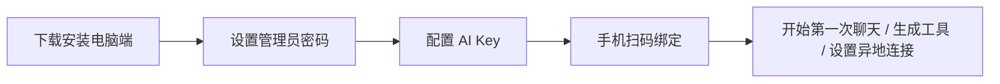
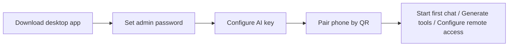

# LifeOS AI Quick Start / 快速开始

中文 | [English](#english)

## 5 分钟开始使用

这条路径面向普通用户：不需要先理解代码，只需要完成电脑端安装、AI Key、手机绑定。



## 第 1 步：下载电脑端

打开 [GitHub Releases](https://github.com/WGJ-Fry/lifeos-ai/releases/tag/v0.1.0)，按系统下载：

| 系统 | 下载 |
| --- | --- |
| macOS Apple Silicon | `LifeOS.AI-0.1.0-arm64-unsigned.zip` |
| Windows x64 | 准备中 |
| Linux x64 | 准备中 |

macOS 当前公开的是 unsigned ZIP，解压后把 `LifeOS AI.app` 拖入 Applications；如遇 Gatekeeper 提示，请查看 Release 附件里的 `INSTALL-unsigned-mac.md`。Windows 和 Linux 安装包仍在准备上传。请只从 GitHub Release 下载，并对照 `SHA256SUMS` 校验。

## 第 2 步：首次打开

打开 LifeOS AI 后，先完成首次启动：

1. 设置管理员密码。
2. 查看安全自检。
3. 配置 AI Key、创建备份、绑定手机。
4. 完成向导后直接进入第一次聊天。

如果本地核心启动失败，桌面失败页现在会直接提供 `Retry LifeOS AI`、`Open Local Console In Browser`、`Copy Local Address`、`Open Logs Folder`、`Copy Logs Path`、`Export Desktop Diagnostics`，不用先自己找日志位置；如果只是桌面窗口异常，本地核心仍然可用时，可以先用浏览器继续完成管理员设置和手机绑定。

管理员密码只保存在电脑端。异地连接前建议使用较长的短语密码。

## 第 3 步：配置 AI Key

进入管理端的 AI Key 配置区域：

1. 选择 provider：Gemini、OpenAI、OpenRouter 或本地模型。
2. 粘贴 API Key 或本地模型地址。
3. 点击保存。
4. 点击测试，确认连接可用。

AI Key 不会保存到手机端，也不会通过普通 API 返回给前端。

## 第 4 步：绑定手机

在电脑端打开手机绑定页，用手机扫码：

1. 手机浏览器打开绑定页面。
2. 完成绑定。
3. 绑定成功后再添加到主屏幕。

如果先添加到桌面再绑定，某些手机浏览器可能不会保留绑定参数。推荐先绑定成功，再添加到主屏幕。

## 第 5 步：选择连接方式

| 场景 | 推荐方式 |
| --- | --- |
| 手机和电脑在同一 Wi-Fi | 使用连接向导里的 LAN 地址 |
| 手机和电脑不在同一局域网 | 使用 Tailscale |
| 需要 HTTPS 公网入口 | 使用 Cloudflare Tunnel |
| 有自己的域名和服务器 | 使用可信 HTTPS 反向代理 |

不要直接把本地服务暴露到公网 IP。公网/隧道模式前请确认管理员密码、备份、HTTPS 和 `LIFEOS_ALLOW_PUBLIC=1`。

## 第 6 步：开始使用

第一次进入时，完成首次启动向导后会默认进入聊天页，方便立刻发一条测试消息确认整条链路正常。

你可以从这几个入口开始：

- 手机聊天：把手机当随身 AI 管家。
- Studio 工坊：告诉 AI 当前要解决的问题，让它生成可运行的离线程序来辅助处理。
- 备份恢复：创建第一次备份。
- 本地动作：配置导航、网页、电话、短信、邮件、快捷指令等动作白名单。

## 开发者快速启动

```bash
npm install
npm run dev
```

打开：

```text
http://localhost:3000/admin/login
```

常用检查：

```bash
npm run lint
npm test
LIFEOS_RELEASE_SKIP_ARTIFACTS=1 npm run release:check:unsigned
```

## 下一步

- 安装细节：[用户安装指南](user-install-guide.md)
- 异地连接：[常见问题](faq.md)
- 发布准备：[GitHub 发布指南](github-release.md)
- 推广文案：[推广素材包](promotion-kit.md)

---

# English

## Start In Five Minutes

This path is for end users. You do not need to understand the code first; just install the desktop app, configure an AI key, and pair your phone.



## Step 1: Download The Desktop App

Open [GitHub Releases](https://github.com/WGJ-Fry/lifeos-ai/releases/tag/v0.1.0) and download the file for your system:

| System | Download |
| --- | --- |
| macOS Apple Silicon | `LifeOS.AI-0.1.0-arm64-unsigned.zip` |
| Windows x64 | Preparing |
| Linux x64 | Preparing |

The current public macOS artifact is an unsigned ZIP. Unzip it and drag `LifeOS AI.app` into Applications; if Gatekeeper warns, see `INSTALL-unsigned-mac.md` in the release assets. Windows and Linux installers are still being prepared for upload. Download only from GitHub Releases and verify `SHA256SUMS`.

## Step 2: First Launch

After opening LifeOS AI:

1. Set the administrator password.
2. Review the safety checks.
3. Configure the AI key, create a backup, and pair the phone.
4. Finish the guide and go straight into the first chat.

If the local core fails to start, the desktop failure page now gives direct recovery actions: `Retry LifeOS AI`, `Open Local Console In Browser`, `Copy Local Address`, `Open Logs Folder`, `Copy Logs Path`, and `Export Desktop Diagnostics`. If the desktop window is the only thing that failed, you can keep going in the browser and still finish admin setup and phone pairing.

The admin password is stored only on the desktop. Use a longer passphrase before enabling remote access.

## Step 3: Configure An AI Key

In the admin AI Key settings:

1. Pick a provider: Gemini, OpenAI, OpenRouter, or local model.
2. Paste the API key or local model endpoint.
3. Save it.
4. Test the connection.

AI keys are not stored on the phone and are not returned through normal frontend APIs.

## Step 4: Pair Your Phone

Open the phone pairing page on desktop and scan the QR code:

1. Open the pairing page in the phone browser.
2. Complete pairing.
3. Add the PWA to the home screen after pairing succeeds.

If you add the page to the home screen before pairing, some mobile browsers may drop the pairing parameters.

## Step 5: Pick A Connection Mode

| Scenario | Recommended mode |
| --- | --- |
| Phone and desktop on the same Wi-Fi | LAN address from the connection guide |
| Phone and desktop away from each other | Tailscale |
| HTTPS public entry needed | Cloudflare Tunnel |
| Own domain and server available | Trusted HTTPS reverse proxy |

Do not expose the local service directly to a public IP. Before public/tunnel mode, verify the admin password, backups, HTTPS, and `LIFEOS_ALLOW_PUBLIC=1`.

## Step 6: Start Using It

On first launch, finishing the guide now takes you directly to the chat page so you can send one test message right away and confirm the whole path is working.

Good first places to try:

- Mobile chat: use the phone as your personal AI companion.
- Studio workshop: explain the current problem and let AI generate a runnable offline program to help solve it.
- Backup and restore: create your first backup.
- Local actions: configure allowlisted maps, web, phone, SMS, mail, and shortcuts.

## Developer Quick Start

```bash
npm install
npm run dev
```

Open:

```text
http://localhost:3000/admin/login
```

Common checks:

```bash
npm run lint
npm test
LIFEOS_RELEASE_SKIP_ARTIFACTS=1 npm run release:check:unsigned
```

## Next

- Install details: [User Install Guide](user-install-guide.md)
- Remote access: [FAQ](faq.md)
- Release prep: [GitHub Release Guide](github-release.md)
- Launch copy: [Promotion Kit](promotion-kit.md)
